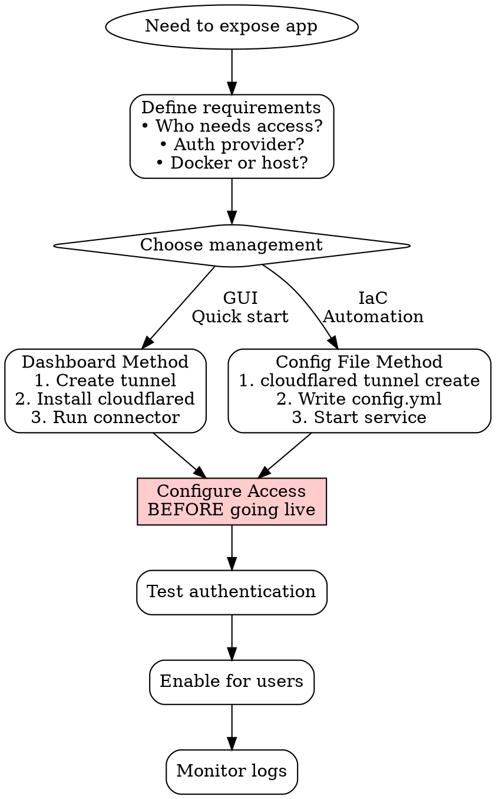
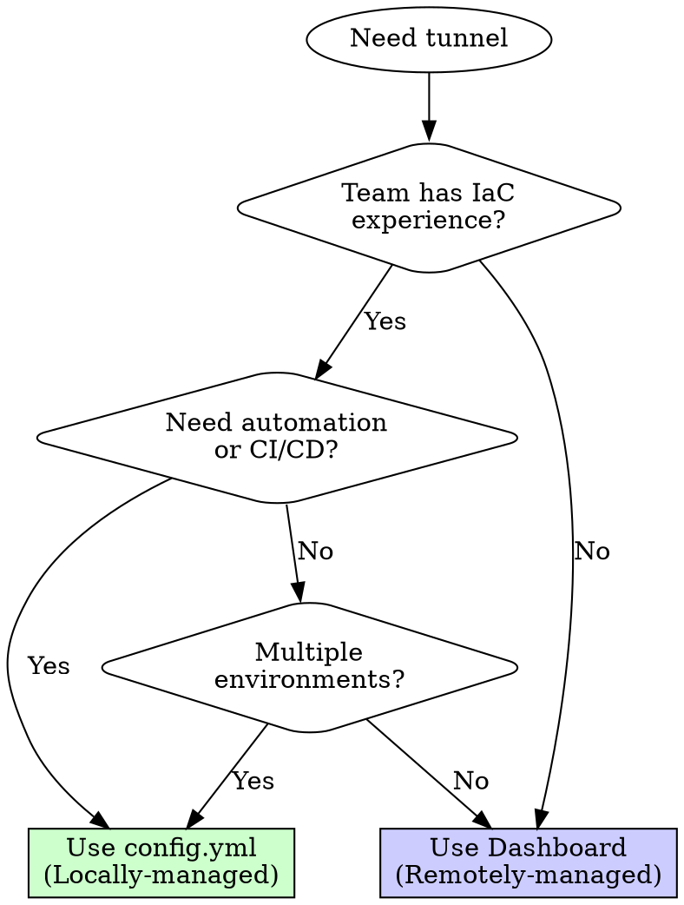

# Cloudflare Zero Trust

## Overview

Cloudflare Zero Trust provides secure remote access to applications without VPN, using Cloudflare Tunnel (secure connectivity) and Cloudflare Access (authentication/authorization).

**Core principle:** Authentication is not optional. Every tunnel must have access controls from day one.

## When to Use

Use this skill when:
- Setting up Cloudflare Tunnel for any application
- Configuring Cloudflare Access authentication
- Exposing internal applications securely
- Replacing VPN access with zero-trust model
- Integrating OIDC/SSO providers (Azure AD, Okta, Google)
- Running cloudflared in Docker containers
- Troubleshooting 502 Bad Gateway errors
- Managing tunnels via dashboard or CLI

**Symptoms that trigger this skill:**
- "Need to expose local app to internet"
- "Setting up Cloudflare Tunnel"
- "Add authentication to tunnel"
- "Configure Azure AD / Okta / OIDC"
- "502 Bad Gateway on Cloudflare Tunnel"
- "Run cloudflared in Docker"

## Security-First Principle

```
UNAUTHENTICATED TUNNEL = PUBLICLY EXPOSED SERVICE = SECURITY INCIDENT
```

**Authentication is mandatory, not optional.**

If you find yourself thinking:
- "We'll add authentication later"
- "It's been working fine without auth"
- "Don't want to disrupt users with login"
- "Can we skip auth for internal apps?"
- "Demo first, secure later"

**STOP. These are security violations.**

Correct mindset:
- Tunnel without auth = exposed service = critical vulnerability
- User convenience < security requirement
- "Internal only" is not a security control
- Demos should be secure by default

## Quick Reference

| Task | Remotely-Managed (Dashboard) | Locally-Managed (config.yml) |
|------|------------------------------|------------------------------|
| **Best for** | GUI users, quick setup, team collaboration | IaC, automation, version control, CI/CD |
| **Setup** | Dashboard → Create Tunnel → Configure routes | `cloudflared tunnel create` + config.yml |
| **Changes** | Click to update | Edit config, restart service |
| **Access Control** | Always via dashboard (Zero Trust → Access) | Tunnel via config, Access via dashboard |
| **Docker** | Env vars for credentials | Mount config.yml + credentials JSON |

## Tunnel Setup Workflow

**BEFORE creating tunnel, choose management approach** using the decision tree in "Dashboard vs CLI Decision Tree" section below.



**Critical:** Configure Access authentication BEFORE exposing the tunnel. Never deploy unauthenticated tunnels, even "temporarily."

## Remotely-Managed Tunnels (Dashboard)

**When to use:**
- Team prefers GUI
- Quick proof-of-concept (that still needs auth!)
- Visual route management
- Less technical team members

**Setup:**
1. **Zero Trust → Networks → Tunnels → Create**
2. **Choose connector type:** Cloudflared
3. **Name tunnel:** e.g., `prod-api-tunnel`
4. **Install cloudflared** on origin server
5. **Run connector:** Copy token from dashboard
   ```bash
   cloudflared service install <TOKEN>
   ```
6. **Configure routes:** Dashboard → Public Hostname
   - Hostname: `api.example.com`
   - Service: `http://localhost:8080`
7. **Configure Access** (see Access Configuration section)

**Advantages:**
- Visual configuration
- Easy for team members
- Built-in health monitoring

**Disadvantages:**
- Not in version control
- Harder to automate
- Must use dashboard for changes

## Locally-Managed Tunnels (config.yml)

**When to use:**
- Infrastructure as code
- CI/CD automation
- Version control for config
- Multiple environments (dev/staging/prod)
- Docker containers

**Setup:**

1. **Create tunnel:**
   ```bash
   cloudflared tunnel create myapp-tunnel
   ```
   Outputs: `~/.cloudflared/<TUNNEL_ID>.json` (credentials)

2. **Create config file** (`~/.cloudflared/config.yml`):
   ```yaml
   tunnel: <TUNNEL_ID>
   credentials-file: /etc/cloudflared/<TUNNEL_ID>.json

   ingress:
     # Route myapp.example.com to local service
     - hostname: myapp.example.com
       service: http://localhost:8080
       originRequest:
         noTLSVerify: false  # Verify origin certs
         connectTimeout: 30s
         httpHostHeader: myapp.example.com

     # Multiple services example
     - hostname: api.example.com
       service: http://localhost:8080
     - hostname: admin.example.com
       service: http://localhost:3000

     # Catch-all (required, must be last)
     - service: http_status:404

   # Logging
   loglevel: info
   ```

3. **Route DNS:**
   ```bash
   cloudflared tunnel route dns myapp-tunnel myapp.example.com
   ```

4. **Run tunnel:**
   ```bash
   # Foreground (testing)
   cloudflared tunnel run myapp-tunnel

   # As service (production)
   sudo cloudflared service install
   sudo systemctl start cloudflared
   sudo systemctl enable cloudflared
   ```

5. **Configure Access** (see next section)

**Advantages:**
- Version controlled
- Easy automation
- Consistent across environments
- Docker-friendly

**Disadvantages:**
- Requires editing config files
- Restart needed for changes
- More initial setup

## Modern Protocols (WebSockets, HTTP/2, gRPC)

**Cloudflare Tunnel fully supports modern protocols** - WebSockets, HTTP/2, and gRPC work by default with specific configuration.

### WebSockets Support

**Status:** ✅ Fully supported, no additional configuration needed

WebSockets work automatically through Cloudflare Tunnel:

```yaml
ingress:
  - hostname: ws.example.com
    service: http://localhost:8080  # WebSocket server
  - service: http_status:404
```

**Connection flow:**
1. Client connects to `wss://ws.example.com`
2. Cloudflare Tunnel proxies WebSocket upgrade request
3. Connection persists for duration of session
4. Bidirectional communication maintained

**Configuration tips:**

```yaml
ingress:
  - hostname: ws.example.com
    service: http://localhost:8080
    originRequest:
      noTLSVerify: false
      connectTimeout: 30s
      # WebSocket-specific tuning
      keepAliveTimeout: 90s      # Keep connection alive
      keepAliveConnections: 100  # Connection pool size
```

**Common issues:**

| Issue | Cause | Solution |
|-------|-------|----------|
| Connection drops after 100s | Default keepalive timeout | Increase `keepAliveTimeout: 300s` |
| High reconnection rate | Connection pool too small | Increase `keepAliveConnections` |
| Initial handshake fails | TLS verification mismatch | Check `noTLSVerify` setting |

**Test WebSocket connection:**
```javascript
// Client-side test
const ws = new WebSocket('wss://ws.example.com');

ws.onopen = () => {
  console.log('Connected via Cloudflare Tunnel');
  ws.send(JSON.stringify({ type: 'ping' }));
};

ws.onmessage = (event) => {
  console.log('Received:', event.data);
};
```

### HTTP/2 Support

**Status:** ✅ Supported with origin configuration

Cloudflare can connect to your origin using HTTP/2:

**Requirements:**
- Origin must support HTTP/2 (most modern servers do)
- TLS required on origin
- Certificate must be valid (or `noTLSVerify: true`)

**Configuration:**

```yaml
ingress:
  - hostname: api.example.com
    service: https://localhost:443  # HTTPS origin
    originRequest:
      http2Origin: true             # Enable HTTP/2 to origin
      disableChunkedEncoding: true  # Required for HTTP/2
```

**Benefits of HTTP/2:**
- Multiplexing (multiple requests over single connection)
- Header compression (reduced overhead)
- Server push (proactive resource delivery)
- Better performance for high-traffic origins

**Troubleshooting:**

```bash
# Test HTTP/2 support from tunnel host
curl -v --http2 https://localhost:443

# Look for:
# * ALPN, offering h2
# * Using HTTP2, server supports multi-use

# If not working:
# - Check origin server HTTP/2 configuration
# - Verify TLS certificate is valid
# - Ensure no intermediate proxies downgrade to HTTP/1.1
```

### gRPC Support

**Status:** ✅ Supported for private network routing (not public hostname yet)

**Important limitations:**
- gRPC over **private network routing** (WARP) - ✅ Fully supported
- gRPC over **public hostname** - ❌ Not yet supported

**For private network gRPC:**

1. **Enable WARP routing:**
   ```yaml
   warp-routing:
     enabled: true
   ```

2. **Route gRPC service:**
   ```bash
   cloudflared tunnel route ip add 10.0.0.0/24 grpc-tunnel
   ```

3. **gRPC requirements met:**
   - HTTP/2 advertised over ALPN ✅
   - `Content-Type: application/grpc` or `application/grpc+proto` ✅
   - Bidirectional streaming ✅

**gRPC configuration:**

```yaml
tunnel: <TUNNEL_ID>
credentials-file: /etc/cloudflared/credentials.json

warp-routing:
  enabled: true

ingress:
  - service: http_status:404
```

**Client connection (via WARP):**
```python
import grpc

# User must be connected to WARP
# Then can access private gRPC service directly
channel = grpc.insecure_channel('10.0.0.50:50051')
stub = MyServiceStub(channel)
```

**Docker with gRPC:**

```yaml
# docker-compose.yml
services:
  grpc-server:
    image: grpc-app:latest
    ports:
      - "50051:50051"
    networks:
      - private-network

  cloudflared:
    image: cloudflare/cloudflared:latest
    command: tunnel --config /etc/cloudflared/config.yml run
    volumes:
      - ./config.yml:/etc/cloudflared/config.yml:ro
      - ./credentials.json:/etc/cloudflared/credentials.json:ro
    networks:
      - private-network
```

### Protocol Detection and ALPN

**How Cloudflare determines protocol:**

1. **TLS/ALPN negotiation:**
   - Client advertises supported protocols (h2, http/1.1)
   - Cloudflare selects based on server support
   - Protocol established during handshake

2. **Without ALPN:**
   - Falls back to HTTP/1.1
   - WebSocket upgrades still work

**Verify ALPN:**
```bash
# Check ALPN support
openssl s_client -connect your-origin:443 -alpn h2,http/1.1 < /dev/null | grep ALPN

# Expected output:
# ALPN protocol: h2

# If empty:
# - Origin doesn't support HTTP/2
# - TLS configuration incomplete
# - Certificate issue
```

### Performance Optimization for Modern Protocols

**WebSocket tuning:**
```yaml
originRequest:
  keepAliveTimeout: 300s      # Long-lived connections
  keepAliveConnections: 200   # Higher pool for WS
  tcpKeepAlive: 30s          # TCP-level keepalive
```

**HTTP/2 tuning:**
```yaml
originRequest:
  http2Origin: true
  disableChunkedEncoding: true
  connectTimeout: 10s         # Faster for multiplexed
  keepAliveConnections: 50    # Fewer needed with multiplexing
```

**gRPC best practices:**
- Use WARP routing, not public hostname attempts
- Enable HTTP/2 on origin
- Configure load balancing for gRPC (client-side or proxy)
- Monitor connection counts (gRPC reuses connections)

### Common Mistakes - Modern Protocols

**❌ Wrong: HTTP/2 without TLS**
```yaml
ingress:
  - hostname: api.example.com
    service: http://localhost:80  # HTTP only
    originRequest:
      http2Origin: true  # Won't work without TLS!
```

**✅ Right:**
```yaml
ingress:
  - hostname: api.example.com
    service: https://localhost:443  # HTTPS
    originRequest:
      http2Origin: true
```

**❌ Wrong: gRPC over public hostname**
```yaml
ingress:
  - hostname: grpc.example.com  # Not supported yet
    service: http://localhost:50051
```

**✅ Right:**
```yaml
# Use WARP routing instead
warp-routing:
  enabled: true
# Then cloudflared tunnel route ip add 10.0.0.0/24 tunnel-name
```

**❌ Wrong: Small keepalive for WebSockets**
```yaml
originRequest:
  keepAliveTimeout: 30s  # Too short, connections drop
```

**✅ Right:**
```yaml
originRequest:
  keepAliveTimeout: 300s  # 5 minutes, stable connections
```

## Docker Container Setup

**When to use:**
- Containerized infrastructure
- Docker Compose environments
- Kubernetes/orchestration
- Portable deployments

### Docker Compose Example

**Directory structure:**
```
project/
├── docker-compose.yml
├── cloudflared/
│   ├── config.yml
│   └── credentials.json  # From cloudflared tunnel create
```

**docker-compose.yml:**
```yaml
version: '3.8'

services:
  # Your application
  myapp:
    image: myapp:latest
    ports:
      - "8080:8080"
    networks:
      - app-network

  # Cloudflare Tunnel
  cloudflared:
    image: cloudflare/cloudflared:latest
    command: tunnel --config /etc/cloudflared/config.yml run
    volumes:
      - ./cloudflared/config.yml:/etc/cloudflared/config.yml:ro
      - ./cloudflared/credentials.json:/etc/cloudflared/credentials.json:ro
    networks:
      - app-network
    restart: unless-stopped
    depends_on:
      - myapp
    healthcheck:
      test: ["CMD", "cloudflared", "tunnel", "info"]
      interval: 30s
      timeout: 10s
      retries: 3

networks:
  app-network:
    driver: bridge
```

**cloudflared/config.yml:**
```yaml
tunnel: <TUNNEL_ID>
credentials-file: /etc/cloudflared/credentials.json

ingress:
  - hostname: myapp.example.com
    service: http://myapp:8080  # Use container name
    originRequest:
      noTLSVerify: false
  - service: http_status:404

loglevel: info
```

**Setup steps:**
1. Create tunnel: `cloudflared tunnel create myapp-tunnel`
2. Copy `~/.cloudflared/<TUNNEL_ID>.json` to `cloudflared/credentials.json`
3. Update `config.yml` with `<TUNNEL_ID>`
4. Route DNS: `cloudflared tunnel route dns myapp-tunnel myapp.example.com`
5. Start: `docker-compose up -d`
6. Configure Access (dashboard)

**Health checks:**
```bash
# Check tunnel status
docker-compose logs cloudflared

# Verify connections
docker-compose exec cloudflared cloudflared tunnel info
```

### Kubernetes Example

**cloudflared-deployment.yaml:**
```yaml
apiVersion: v1
kind: Secret
metadata:
  name: cloudflared-credentials
type: Opaque
stringData:
  credentials.json: |
    <contents of tunnel credentials>
---
apiVersion: v1
kind: ConfigMap
metadata:
  name: cloudflared-config
data:
  config.yml: |
    tunnel: <TUNNEL_ID>
    credentials-file: /etc/cloudflared/credentials.json
    ingress:
      - hostname: myapp.example.com
        service: http://myapp-service:8080
      - service: http_status:404
---
apiVersion: apps/v1
kind: Deployment
metadata:
  name: cloudflared
spec:
  replicas: 2  # Redundancy
  selector:
    matchLabels:
      app: cloudflared
  template:
    metadata:
      labels:
        app: cloudflared
    spec:
      containers:
      - name: cloudflared
        image: cloudflare/cloudflared:latest
        args:
          - tunnel
          - --config
          - /etc/cloudflared/config.yml
          - run
        volumeMounts:
          - name: config
            mountPath: /etc/cloudflared/config.yml
            subPath: config.yml
          - name: credentials
            mountPath: /etc/cloudflared/credentials.json
            subPath: credentials.json
        livenessProbe:
          exec:
            command:
              - cloudflared
              - tunnel
              - info
          initialDelaySeconds: 30
          periodSeconds: 30
      volumes:
        - name: config
          configMap:
            name: cloudflared-config
        - name: credentials
          secret:
            secretName: cloudflared-credentials
```

## Private Network Routing (Non-HTTP Services)

**Beyond HTTP:** Cloudflare Tunnel can expose ANY TCP/UDP service - SSH, RDP, databases, custom protocols.

### When to Use Private Network Routing

Use for:
- SSH access to servers
- RDP for Windows desktops
- Database connections (PostgreSQL, MySQL, Redis)
- Internal APIs and services
- Custom TCP/UDP applications

### Two Approaches

| Approach | Best For | Setup |
|----------|----------|-------|
| **Application Tunnel** | Specific services (SSH to specific server) | Single ingress rule per service |
| **WARP Routing** | Full private network access (entire CIDR) | `warp-routing` enabled, IP routes |

### Application Tunnel for Specific Services

**Configure non-HTTP protocols in config.yml:**

```yaml
tunnel: <TUNNEL_ID>
credentials-file: /etc/cloudflared/credentials.json

ingress:
  # SSH to specific server
  - hostname: ssh.example.com
    service: ssh://192.168.1.10:22

  # RDP to Windows desktop
  - hostname: rdp.example.com
    service: rdp://192.168.1.20:3389

  # PostgreSQL database
  - hostname: db.example.com
    service: tcp://192.168.1.30:5432

  # Redis
  - hostname: redis.example.com
    service: tcp://192.168.1.40:6379

  # Catch-all
  - service: http_status:404
```

**Route DNS for each service:**
```bash
cloudflared tunnel route dns myapp-tunnel ssh.example.com
cloudflared tunnel route dns myapp-tunnel rdp.example.com
cloudflared tunnel route dns myapp-tunnel db.example.com
```

**Client-side access (user's machine):**

Users need `cloudflared access` command as local proxy:

```bash
# SSH example
cloudflared access ssh --hostname ssh.example.com --destination 192.168.1.10:22

# Or configure SSH config (~/.ssh/config)
Host ssh.example.com
  ProxyCommand cloudflared access ssh --hostname %h
```

**Database access example:**
```bash
# Start local proxy
cloudflared access tcp --hostname db.example.com --url localhost:5432

# Then connect normally
psql -h localhost -p 5432 -U dbuser
```

### WARP Routing for Full Private Networks

**When to use:**
- Need access to entire private network (192.168.0.0/16)
- Many services, don't want individual tunnels
- Dynamic IPs or service discovery

**Setup:**

1. **Enable WARP routing in tunnel:**
   ```bash
   cloudflared tunnel create private-network-tunnel
   ```

2. **Add IP routes:**
   ```bash
   # Route entire private subnet through tunnel
   cloudflared tunnel route ip add 192.168.0.0/16 private-network-tunnel
   cloudflared tunnel route ip add 10.0.0.0/8 private-network-tunnel
   ```

3. **Configure tunnel for WARP routing:**
   ```yaml
   tunnel: <TUNNEL_ID>
   credentials-file: /etc/cloudflared/credentials.json

   warp-routing:
     enabled: true
   ```

4. **Users connect via WARP client:**
   - Install WARP client on user devices
   - Enroll in Zero Trust organization
   - Access entire private network seamlessly

**WARP Connector vs cloudflared:**

| Feature | cloudflared + WARP routing | WARP Connector (beta) |
|---------|---------------------------|----------------------|
| **Use case** | Application tunnels + private network | Site-to-site, mesh networking |
| **Setup** | Install cloudflared, enable WARP routing | Dedicated connector deployment |
| **Routing** | Manual IP route configuration | Automatic route discovery |
| **Bidirectional** | No (only inbound to private network) | Yes (site-to-site) |

### Container Networking for Private Network Routing

**Docker Compose with private network access:**

```yaml
version: '3.8'

services:
  cloudflared:
    image: cloudflare/cloudflared:latest
    command: tunnel --config /etc/cloudflared/config.yml run
    volumes:
      - ./cloudflared/config.yml:/etc/cloudflared/config.yml:ro
      - ./cloudflared/credentials.json:/etc/cloudflared/credentials.json:ro
    networks:
      - app-network
      - private-network  # Access to private services
    restart: unless-stopped

  # Private service example
  database:
    image: postgres:16
    networks:
      - private-network
    environment:
      POSTGRES_PASSWORD: secret

networks:
  app-network:
    driver: bridge
  private-network:
    driver: bridge
```

**Important:** Use service names in `ingress` when referencing containers:
```yaml
ingress:
  - hostname: db.example.com
    service: tcp://database:5432  # service name, not localhost
```

### Access Policies for Private Networks

**SSH with Access:**

1. **Create Access application:**
   - Type: Self-hosted
   - Domain: `ssh.example.com`
   - Session duration: 2 hours (shorter for SSH)

2. **Policy with purpose justification:**
   ```
   Name: SSH Access with Justification
   Action: Allow
   Include: Azure AD Groups → DevOps Engineers
   Require: Purpose Justification
   ```

3. **MFA requirement:**
   ```
   Name: SSH Requires MFA
   Action: Allow
   Include: Email domains → @company.com
   Require: Authentication Method → Azure AD MFA
   ```

**Database access policy:**
```
Name: Database Access - Read Only
Action: Allow
Include: Azure AD Groups → Data Analysts
Session Duration: 8 hours
```

### Common Mistakes - Private Networks

**❌ Wrong:**
```yaml
# Using localhost for containerized service
ingress:
  - hostname: db.example.com
    service: tcp://localhost:5432  # Won't work!
```

**✅ Right:**
```yaml
# Using service name
ingress:
  - hostname: db.example.com
    service: tcp://database:5432  # Container service name
```

**❌ Wrong:**
```bash
# Exposing database without Access policy
cloudflared tunnel route dns tunnel db.example.com
# Database now publicly accessible via tunnel!
```

**✅ Right:**
```bash
# Configure Access FIRST
# Dashboard → Access → Applications → Add application
# Type: Self-hosted → db.example.com → Create policies

# THEN route DNS
cloudflared tunnel route dns tunnel db.example.com
```

### Troubleshooting Private Network Access

**"Connection refused" on SSH:**
```bash
# Check tunnel can reach SSH server
cloudflared tunnel info <TUNNEL_NAME>

# Test from tunnel host
ssh -p 22 192.168.1.10  # Should work from tunnel host

# Check ingress rule
grep -A 5 "ssh.example.com" /etc/cloudflared/config.yml
```

**Database connection timeout:**
```bash
# Check TCP connectivity
nc -zv 192.168.1.30 5432  # From tunnel host

# Increase connectTimeout in config.yml
ingress:
  - hostname: db.example.com
    service: tcp://192.168.1.30:5432
    originRequest:
      connectTimeout: 60s  # Default 30s
      tcpKeepAlive: 30s
```

**WARP routing not working:**
```bash
# Verify IP routes
cloudflared tunnel route ip list

# Check warp-routing enabled
grep -A 2 "warp-routing" /etc/cloudflared/config.yml

# Test from WARP client
# User must be enrolled in Zero Trust organization
ping 192.168.1.10  # Should work with WARP connected
```

## Access Configuration

**Configure Access BEFORE exposing tunnel to users.**

### Self-Hosted Applications

1. **Zero Trust → Access → Applications → Add an application**

2. **Choose "Self-hosted"**

3. **Application Configuration:**
   - **Name:** `My Application`
   - **Session Duration:** `24 hours` (default)
   - **Application domain:** `myapp.example.com`
   - **Accept all available identity providers:** Checked (or select specific)

4. **Add policies** (at least one Allow policy required):

**Example policies:**

**Email-based:**
```
Name: Allow specific users
Action: Allow
Include: Emails → user1@example.com, user2@example.com
```

**Domain-based:**
```
Name: Allow company domain
Action: Allow
Include: Email domains → @company.com
```

**Group-based (requires IdP groups):**
```
Name: Allow admins group
Action: Allow
Include: Azure AD Groups → Admins
```

**Multi-factor authentication:**
```
Name: Require MFA for admins
Action: Allow
Include: Email domains → @company.com
Require: Authentication Method → mTLS, WARP, Service Token (select MFA method)
```

5. **Optional settings:**
   - **Purpose justification:** Require users to state reason for access
   - **Temporary authentication:** Approve access requests manually
   - **IdP groups:** Use groups from Azure AD, Okta, etc.

### SaaS Applications

For integrated SaaS apps (Salesforce, Workday, etc.):

1. **Zero Trust → Access → Applications → Add an application**
2. **Choose "SaaS"**
3. **Select application** from catalog
4. **Follow integration wizard** (varies by app)
5. **Configure policies** (same as self-hosted)

### OIDC / SSO Integration

#### Azure AD (Entra ID)

**Azure AD setup:**
1. **Azure Portal → Azure Active Directory → App registrations → New registration**
2. **Name:** `Cloudflare Access`
3. **Redirect URI:** `https://<your-team-name>.cloudflareaccess.com/cdn-cgi/access/callback`
4. **Register**, copy **Application (client) ID**
5. **Certificates & secrets → New client secret**, copy value
6. **API permissions → Add permission → Microsoft Graph → Group.Read.All** (for group-based policies)
7. **Token configuration → Add groups claim → Security groups**

**Cloudflare configuration:**
1. **Zero Trust → Settings → Authentication → Add new → Azure AD**
2. **Name:** `Azure AD`
3. **App ID:** `<Application (client) ID>`
4. **Client secret:** `<Secret value>`
5. **Directory (tenant) ID:** From Azure AD overview
6. **Support groups:** Checked (if using group-based policies)
7. **Test** and **Save**

**Use in policies:**
```
Name: Allow Admins group
Action: Allow
Include: Azure AD Groups → select "Admins" group
```

#### Okta

1. **Okta Admin → Applications → Create App Integration → OIDC - Web Application**
2. **Name:** `Cloudflare Access`
3. **Grant type:** Authorization Code
4. **Sign-in redirect URI:** `https://<team-name>.cloudflareaccess.com/cdn-cgi/access/callback`
5. **Assignments:** Select groups
6. Copy **Client ID** and **Client secret**

**Cloudflare:**
1. **Zero Trust → Settings → Authentication → Add new → Okta**
2. **Okta account URL:** `https://your-domain.okta.com`
3. **App ID** and **Client secret**
4. **Support groups:** Checked
5. **Test** and **Save**

#### Generic OIDC Provider

For providers not in catalog:

1. **Zero Trust → Settings → Authentication → Add new → OpenID Connect**
2. **Name:** Provider name
3. **App ID (Client ID)**
4. **Client Secret**
5. **Auth URL:** `https://provider.com/oauth2/authorize`
6. **Token URL:** `https://provider.com/oauth2/token`
7. **Certificate URL (JWKS):** `https://provider.com/.well-known/jwks.json`
8. **Proof Key for Code Exchange (PKCE):** Checked if supported
9. **Support groups:** If provider supports groups claim
10. **Test** and **Save**

### Access Policy Design

**Principle: Least privilege by default.**

**Policy evaluation order:**
1. Bypass policies (skip authentication)
2. Block policies (explicit deny)
3. Allow policies (grant access)
4. Service Auth (API tokens, service-to-service)

**Good policy patterns:**

**Production application with role-based access:**
```
Policy 1: Block non-employees
  Action: Block
  Include: Everyone
  Exclude: Email domains → @company.com

Policy 2: Allow developers
  Action: Allow
  Include: Azure AD Groups → Developers

Policy 3: Allow admins
  Action: Allow
  Include: Azure AD Groups → Admins
  Require: MFA
```

**Staging environment:**
```
Policy 1: Allow dev team
  Action: Allow
  Include: Email domains → @company.com
  Require: Azure AD Groups → Developers OR Admins
```

**API with service authentication:**
```
Policy 1: Service-to-service
  Action: Service Auth
  Include: Service Token → api-service-token
```

## Service Authentication (M2M / API Access)

**Use service tokens for automated systems and APIs** - no identity provider login required.

### When to Use Service Tokens

Use for:
- CI/CD pipelines accessing APIs
- Microservice-to-microservice communication
- Scheduled jobs and cron tasks
- Monitoring systems and health checks
- Infrastructure automation tools
- Any non-human authentication

**Don't use for:**
- User authentication (use SSO/OIDC instead)
- Interactive applications
- Any scenario with a human user

### How Service Tokens Work

1. **Generate token** in Cloudflare dashboard → Zero Trust → Access → Service Auth
2. **Receive Client ID + Client Secret** (ONLY shown once!)
3. **Add to HTTP headers:**
   ```
   CF-Access-Client-Id: <client-id>
   CF-Access-Client-Secret: <client-secret>
   ```
4. **Access evaluates** → Generates JWT → Grants access

### Creating Service Tokens

**Dashboard:**
1. **Zero Trust → Access → Service Auth → Create Service Token**
2. **Name:** `ci-cd-pipeline` (descriptive)
3. **Duration:** 1 year (or custom)
4. **Save Client ID and Secret** immediately (can't retrieve later)

**API:**
```bash
curl -X POST "https://api.cloudflare.com/client/v4/accounts/${ACCOUNT_ID}/access/service_tokens" \
  -H "Authorization: Bearer ${API_TOKEN}" \
  -H "Content-Type: application/json" \
  --data '{
    "name": "CI Pipeline Token",
    "duration": "8760h"
  }'
```

**Response contains:**
```json
{
  "client_id": "abc123...",
  "client_secret": "def456...",  // SAVE THIS - won't be shown again
  "name": "CI Pipeline Token"
}
```

### Using Service Tokens

**Curl example:**
```bash
curl -H "CF-Access-Client-Id: abc123..." \
     -H "CF-Access-Client-Secret: def456..." \
     https://api.example.com/endpoint
```

**Python example:**
```python
import requests

headers = {
    "CF-Access-Client-Id": "abc123...",
    "CF-Access-Client-Secret": "def456..."
}

response = requests.get("https://api.example.com/endpoint", headers=headers)
```

**Node.js example:**
```javascript
const axios = require('axios');

const headers = {
  'CF-Access-Client-Id': process.env.CF_CLIENT_ID,
  'CF-Access-Client-Secret': process.env.CF_CLIENT_SECRET
};

const response = await axios.get('https://api.example.com/endpoint', { headers });
```

**Docker container:**
```yaml
services:
  api-consumer:
    image: myapp:latest
    environment:
      - CF_CLIENT_ID=${CF_CLIENT_ID}
      - CF_CLIENT_SECRET=${CF_CLIENT_SECRET}
```

### Configuring Service Auth Policies

**Service-only policy:**
```
Name: API Service Authentication
Action: Service Auth
Include: Service Token → ci-cd-pipeline
```

**Important:** Service Auth policy type accepts ONLY service tokens (no user login).

**Mixed policy (users OR service tokens):**
```
Policy 1: Allow Users
  Action: Allow
  Include: Email domains → @company.com

Policy 2: Allow Service Tokens
  Action: Service Auth
  Include: Service Token → ci-cd-pipeline
```

**Per-endpoint policies:**
```yaml
# In your application, check CF_Authorization cookie claims
# Service tokens have distinct claims:
{
  "type": "service_token",
  "sub": "abc123...",  // Client ID
  "aud": ["https://api.example.com"]
}
```

### Token Rotation Strategy

**Best practices:**
1. **Generate new token** before old expires
2. **Update consuming services** with new credentials
3. **Test** new token works
4. **Revoke old token** after grace period

**Rotation workflow:**
```bash
# 1. Create new token
curl -X POST ".../access/service_tokens" \
  --data '{"name": "ci-pipeline-2025-02", "duration": "8760h"}'

# 2. Update secrets in CI/CD
# GitHub: Settings → Secrets → Update CF_CLIENT_ID, CF_CLIENT_SECRET
# GitLab: Settings → CI/CD → Variables → Update

# 3. Test new token
curl -H "CF-Access-Client-Id: NEW_ID" \
     -H "CF-Access-Client-Secret: NEW_SECRET" \
     https://api.example.com/health

# 4. Revoke old token (after grace period)
curl -X DELETE ".../access/service_tokens/${OLD_TOKEN_ID}" \
  -H "Authorization: Bearer ${API_TOKEN}"
```

**Automated rotation (recommended):**
- Rotate every 90 days
- Use secrets manager (AWS Secrets Manager, HashiCorp Vault, OCI Vault)
- Automate with Terraform or scripts

### Security Best Practices

**Storage:**
- ✅ **Store in environment variables or secrets manager**
- ✅ **Never commit to git**
- ✅ **Use secrets scanning** (GitHub secret scanning, GitGuardian)
- ❌ **Never hardcode in source**
- ❌ **Never log or print secrets**

**Scoping:**
- Create separate tokens per service (easier rotation, blast radius control)
- Use descriptive names: `github-actions-prod`, `jenkins-staging`
- Set shortest duration needed

**Monitoring:**
```bash
# Access authentication logs show service token usage
# Dashboard → Analytics → Access → Logs
# Filter by: Authentication Method = Service Token

# Look for:
# - Failed auth attempts (compromise indicator)
# - Unexpected source IPs
# - High request volume
```

**Revocation:**
```bash
# Immediate revocation if compromised
curl -X DELETE \
  "https://api.cloudflare.com/client/v4/accounts/${ACCOUNT_ID}/access/service_tokens/${TOKEN_ID}" \
  -H "Authorization: Bearer ${API_TOKEN}"
```

### Common Patterns

**CI/CD Pipeline (GitHub Actions):**
```yaml
name: Deploy API
on: [push]
jobs:
  deploy:
    runs-on: ubuntu-latest
    steps:
      - name: Deploy
        env:
          CF_CLIENT_ID: ${{ secrets.CF_CLIENT_ID }}
          CF_CLIENT_SECRET: ${{ secrets.CF_CLIENT_SECRET }}
        run: |
          curl -H "CF-Access-Client-Id: $CF_CLIENT_ID" \
               -H "CF-Access-Client-Secret: $CF_CLIENT_SECRET" \
               https://api.example.com/deploy
```

**Kubernetes Job:**
```yaml
apiVersion: batch/v1
kind: Job
metadata:
  name: api-sync
spec:
  template:
    spec:
      containers:
      - name: sync
        image: myapp:latest
        env:
        - name: CF_CLIENT_ID
          valueFrom:
            secretKeyRef:
              name: cloudflare-service-token
              key: client-id
        - name: CF_CLIENT_SECRET
          valueFrom:
            secretKeyRef:
              name: cloudflare-service-token
              key: client-secret
```

**Monitoring health check:**
```python
# health_check.py
import os
import requests
from datetime import datetime

def check_api():
    headers = {
        "CF-Access-Client-Id": os.environ["CF_CLIENT_ID"],
        "CF-Access-Client-Secret": os.environ["CF_CLIENT_SECRET"]
    }

    try:
        r = requests.get("https://api.example.com/health", headers=headers)
        r.raise_for_status()
        print(f"[{datetime.now()}] API healthy: {r.status_code}")
    except Exception as e:
        print(f"[{datetime.now()}] API unhealthy: {e}")
        # Alert on-call

if __name__ == "__main__":
    check_api()
```

### Troubleshooting Service Tokens

**"Access Denied" with service token:**
```bash
# Check token exists
curl "https://api.cloudflare.com/client/v4/accounts/${ACCOUNT_ID}/access/service_tokens" \
  -H "Authorization: Bearer ${API_TOKEN}"

# Check policy includes token
# Dashboard → Access → Applications → Your App → Policies
# Look for: Service Auth policy with token name

# Verify headers sent correctly
curl -v \
  -H "CF-Access-Client-Id: ${CLIENT_ID}" \
  -H "CF-Access-Client-Secret: ${CLIENT_SECRET}" \
  https://api.example.com/endpoint
# Look for: CF_Authorization cookie in response
```

**Token expired:**
```bash
# Check token expiration
curl "https://api.cloudflare.com/client/v4/accounts/${ACCOUNT_ID}/access/service_tokens/${TOKEN_ID}" \
  -H "Authorization: Bearer ${API_TOKEN}"

# Response includes:
{
  "expires_at": "2025-12-31T23:59:59Z"
}

# If expired, create new token (can't extend existing)
```

**Headers not reaching Access:**
```bash
# Check if application behind additional proxy
# Some proxies strip CF-Access-* headers

# Solution: Configure proxy to preserve headers
# nginx example:
proxy_set_header CF-Access-Client-Id $http_cf_access_client_id;
proxy_set_header CF-Access-Client-Secret $http_cf_access_client_secret;
```

## Troubleshooting

### 502 Bad Gateway

**Error:** `502 Bad Gateway - Unable to reach the origin service`

**Meaning:** Tunnel is connected to Cloudflare, but can't reach your origin.

**Troubleshooting steps:**

1. **Check origin service is running:**
   ```bash
   curl http://localhost:8080
   ```

2. **Check cloudflared logs:**
   ```bash
   sudo journalctl -u cloudflared -n 50 --no-pager  # Systemd
   docker logs cloudflared  # Docker
   ```

3. **Common causes:**

**Wrong port in config:**
```yaml
# Check config.yml
ingress:
  - hostname: app.example.com
    service: http://localhost:8080  # Port correct?
```

**Docker network issue (non-obvious):**
```yaml
# In Docker Compose, use service name not localhost
service: http://myapp:8080  # NOT http://localhost:8080
```

**TLS verification failure:**
```yaml
originRequest:
  noTLSVerify: true  # Only if origin uses self-signed cert
```

4. **Test tunnel independently:**
   ```bash
   sudo systemctl stop cloudflared
   cloudflared tunnel run myapp-tunnel  # See real-time logs
   ```

### Authentication Loop (Redirect Loop)

**Symptom:** Browser keeps redirecting to login, never reaches app

**Causes:**

1. **Access policy too restrictive:**
   - Check Zero Trust → Access → Applications → Your App → Policies
   - Ensure at least one Allow policy matches your user

2. **IdP misconfiguration:**
   - Verify redirect URI in IdP matches Cloudflare
   - Check group claims are being sent

3. **Cookie issues:**
   - Clear cookies for `*.cloudflareaccess.com` and your domain
   - Check browser isn't blocking third-party cookies

4. **Session expired:**
   - Session duration set too short
   - Increase in Access → Applications → Your App → Session Duration

### Tunnel Not Connecting

**Symptom:** Tunnel shows "Inactive" or "Down" in dashboard

**Troubleshooting:**

1. **Check cloudflared is running:**
   ```bash
   sudo systemctl status cloudflared  # or: docker ps | grep cloudflared
   ```

2. **Verify credentials file exists:**
   ```bash
   ls -la ~/.cloudflared/<TUNNEL_ID>.json
   ```

3. **Firewall requirement:** Cloudflared needs outbound HTTPS (443) to `*.argotunnel.com`

4. **Restart tunnel:**
   ```bash
   sudo systemctl restart cloudflared
   ```

### DNS Not Resolving

**Symptom:** `nslookup myapp.example.com` returns no records

**Fix:**

1. **Check DNS record exists:**
   - Cloudflare dashboard → DNS → Records
   - Look for CNAME: `myapp.example.com` → `<TUNNEL_ID>.cfargotunnel.com`

2. **Create if missing:**
   ```bash
   cloudflared tunnel route dns myapp-tunnel myapp.example.com
   ```

3. **Verify:** DNS record should be "Proxied" (orange cloud) in Cloudflare dashboard

## Common Mistakes

### 1. Deploying Without Authentication

**❌ Wrong:**
```bash
# Create tunnel
cloudflared tunnel create myapp
# Route DNS
cloudflared tunnel route dns myapp myapp.example.com
# Run tunnel
cloudflared tunnel run myapp
# ⚠️ APP IS NOW PUBLICLY ACCESSIBLE
```

**✅ Right:**
```bash
# Create tunnel
cloudflared tunnel create myapp
# Route DNS
cloudflared tunnel route dns myapp myapp.example.com
# Configure Access FIRST (dashboard)
# THEN run tunnel
cloudflared tunnel run myapp
```

### 2. Using `noTLSVerify: true` Without Reason

**❌ Wrong:**
```yaml
originRequest:
  noTLSVerify: true  # "Just in case"
```

**✅ Right:**
```yaml
# Only if origin uses self-signed cert
originRequest:
  noTLSVerify: false  # Verify by default
  # OR if self-signed:
  # noTLSVerify: true
  # caPool: /path/to/custom-ca.pem
```

### 3. Wrong Service URL in Docker

**❌ Wrong:**
```yaml
# config.yml
ingress:
  - hostname: app.example.com
    service: http://localhost:8080  # Won't work in Docker!
```

**✅ Right:**
```yaml
# config.yml
ingress:
  - hostname: app.example.com
    service: http://myapp:8080  # Use container name
```

### 4. Bypass Policy for "Internal" Apps

**❌ Wrong:**
```
Policy: Skip auth for internal
Action: Bypass
Include: Everyone
# ⚠️ Anyone with URL can access!
```

**✅ Right:**
```
Policy: Allow employees
Action: Allow
Include: Email domains → @company.com
```

### 5. Hardcoding Credentials in Config

**❌ Wrong:**
```yaml
# config.yml checked into git
tunnel: abc123-def456-...
credentials-file: /etc/cloudflared/credentials.json
# ⚠️ credentials.json also in git!
```

**✅ Right:**
```bash
# .gitignore
*.json
credentials.json
```

Use environment-specific credentials, never commit.

## Dashboard vs CLI Decision Tree



## Browser Automation (Dashboard Management)

**Note:** Browser automation for dashboard management requires MCP claude-in-chrome tools.

**Use cases:**
- Automated tunnel creation via dashboard
- Bulk configuration changes
- Scheduled tunnel audits
- Programmatic route updates

**Pattern:**
```typescript
// Pseudocode - requires claude-in-chrome MCP
const { navigate, click, fill } = mcp_claude_in_chrome;

// Navigate to Zero Trust dashboard
await navigate('https://one.dash.cloudflare.com/');

// Login flow (use saved session or credentials)
// ...

// Create tunnel
await navigate('Networks/Tunnels');
await click('Create a tunnel');
await fill('Tunnel name', 'new-tunnel');
await click('Save tunnel');

// Configure route
await click('Public Hostname');
await fill('Subdomain', 'myapp');
await fill('Domain', 'example.com');
await fill('Service', 'http://localhost:8080');
await click('Save');
```

**Better alternative: Use Cloudflare API**

```bash
# Get tunnels
curl -X GET "https://api.cloudflare.com/client/v4/accounts/${ACCOUNT_ID}/cfd_tunnel" \
  -H "Authorization: Bearer ${API_TOKEN}"

# Create tunnel
curl -X POST "https://api.cloudflare.com/client/v4/accounts/${ACCOUNT_ID}/cfd_tunnel" \
  -H "Authorization: Bearer ${API_TOKEN}" \
  -H "Content-Type: application/json" \
  --data '{
    "name": "new-tunnel",
    "tunnel_secret": "<base64-secret>"
  }'

# Update config
curl -X PUT \
  "https://api.cloudflare.com/client/v4/accounts/${ACCOUNT_ID}/cfd_tunnel/${TUNNEL_ID}/configurations" \
  -H "Authorization: Bearer ${API_TOKEN}" \
  -H "Content-Type: application/json" \
  --data '{
    "config": {
      "ingress": [
        {
          "hostname": "myapp.example.com",
          "service": "http://localhost:8080"
        },
        {
          "service": "http_status:404"
        }
      ]
    }
  }'
```

**When to use browser automation vs API:**
- **API:** Preferred for automation, CI/CD, scripts
- **Browser:** When API doesn't support feature, visual verification needed


## Local Development Workflows

**Quick tunnels for development** - no account setup, instant URL, perfect for testing.

### Quick Tunnels (trycloudflare.com)

**Fastest way to test:** One command, random URL, no configuration.

```bash
# Start quick tunnel
cloudflared tunnel --url http://localhost:8080

# Output:
# Your quick Tunnel has been created! Visit it at:
# https://random-words-123.trycloudflare.com
```

**Characteristics:**
- **Free** - no Cloudflare account needed
- **Random subdomain** - changes each run (e.g., `happy-fox-123.trycloudflare.com`)
- **200 concurrent request limit** - sufficient for development
- **No authentication** - publicly accessible (use with caution)
- **Ephemeral** - tunnel stops when command terminates

**When to use:**
- Local feature testing
- Sharing work-in-progress with teammates
- Webhook development (GitHub, Stripe, etc.)
- Mobile app testing (access localhost from phone)

**When NOT to use:**
- Production deployments
- Sensitive data/applications
- Need stable URLs
- >200 concurrent requests

### Named Development Tunnels

**For stable dev URLs** - same subdomain across restarts.

```bash
# Create named tunnel
cloudflared tunnel create dev-tunnel

# Run with config
cloudflared tunnel --config config-dev.yml run dev-tunnel
```

**config-dev.yml:**
```yaml
tunnel: dev-tunnel
credentials-file: ~/.cloudflared/dev-tunnel.json

ingress:
  - hostname: dev.example.com
    service: http://localhost:3000
  - service: http_status:404
```

**Benefits over quick tunnels:**
- Stable URL (dev.example.com)
- Can add Access authentication
- Version control config
- Multiple services

### Preview Environments Pattern

**Per-branch preview URLs** - like Vercel/Netlify for any stack.

```bash
# In CI/CD (GitHub Actions example)
name: Deploy Preview
on: [pull_request]

jobs:
  preview:
    runs-on: ubuntu-latest
    steps:
      - uses: actions/checkout@v3

      - name: Create tunnel for PR
        env:
          CLOUDFLARE_ACCOUNT_ID: ${{ secrets.CLOUDFLARE_ACCOUNT_ID }}
          CLOUDFLARE_API_TOKEN: ${{ secrets.CLOUDFLARE_API_TOKEN }}
        run: |
          # Create tunnel named after PR number
          TUNNEL_NAME="pr-${{ github.event.pull_request.number }}"
          cloudflared tunnel create $TUNNEL_NAME

          # Route DNS
          cloudflared tunnel route dns $TUNNEL_NAME pr-${{ github.event.pull_request.number }}.example.com

          # Start tunnel in background
          cloudflared tunnel --config config.yml run $TUNNEL_NAME &

          # Run tests against preview URL
          npm test -- --url https://pr-${{ github.event.pull_request.number }}.example.com
```

**Result:** Each PR gets `https://pr-123.example.com`

### Development vs Production Separation

**Pattern:** Separate tunnels for different environments.

| Environment | Tunnel Name | Domain | Auth |
|-------------|-------------|--------|------|
| Local dev | None (quick tunnel) | random.trycloudflare.com | None |
| Dev | dev-tunnel | dev.example.com | Email-based |
| Staging | staging-tunnel | staging.example.com | Email domain |
| Production | prod-tunnel | app.example.com | Azure AD + MFA |

**Config management:**
```bash
# Directory structure
tunnels/
├── dev/
│   ├── config.yml
│   └── credentials.json
├── staging/
│   ├── config.yml
│   └── credentials.json
└── prod/
    ├── config.yml
    └── credentials.json

# Switch environments
cd tunnels/dev && cloudflared tunnel run dev-tunnel
cd tunnels/prod && cloudflared tunnel run prod-tunnel
```

### Hot Reload Development

**Pattern:** Tunnel stays running, app restarts on changes.

```yaml
# docker-compose-dev.yml
services:
  app:
    build: .
    volumes:
      - .:/app  # Mount source for hot reload
    command: npm run dev
    environment:
      - NODE_ENV=development

  cloudflared:
    image: cloudflare/cloudflared:latest
    command: tunnel --url http://app:3000
    depends_on:
      - app
```

```bash
# Start with hot reload
docker-compose -f docker-compose-dev.yml up

# Tunnel URL stays stable while you code
# App restarts on file changes
# No tunnel restart needed
```

### Testing Webhooks Locally

**Pattern:** Expose localhost to receive webhooks.

```bash
# Terminal 1: Start app
npm run dev  # Runs on localhost:3000

# Terminal 2: Start tunnel
cloudflared tunnel --url http://localhost:3000

# Output: https://random-abc-123.trycloudflare.com

# Terminal 3: Configure webhook
curl -X POST https://api.github.com/repos/user/repo/hooks \
  -H "Authorization: token $GITHUB_TOKEN" \
  --data '{
    "name": "web",
    "active": true,
    "events": ["push", "pull_request"],
    "config": {
      "url": "https://random-abc-123.trycloudflare.com/webhooks/github",
      "content_type": "json"
    }
  }'

# Now receive webhook events locally!
```

### Common Development Patterns

**Pattern 1: Frontend + Backend separation**
```bash
# Backend on port 8080
cd backend && npm run dev

# Frontend on port 3000
cd frontend && npm run dev

# Expose both via tunnel
cloudflared tunnel --url http://localhost:3000
# Frontend: https://abc-123.trycloudflare.com

cloudflared tunnel --url http://localhost:8080
# Backend: https://def-456.trycloudflare.com
```

**Pattern 2: Database GUI access**
```bash
# Run database locally
docker run -p 5432:5432 postgres

# Run Adminer (database GUI)
docker run -p 8080:8080 adminer

# Expose GUI via tunnel
cloudflared tunnel --url http://localhost:8080
# Share URL with team: https://db-admin-789.trycloudflare.com
```

**Pattern 3: Mobile app development**
```bash
# Start local API
npm run dev  # localhost:3000

# Expose via tunnel
cloudflared tunnel --url http://localhost:3000
# Output: https://mobile-api-123.trycloudflare.com

# Configure mobile app to use tunnel URL
# Test on physical device without complex network setup
```

---


## Terraform / Infrastructure as Code

**Manage Cloudflare Tunnel and Access with code** - version controlled, repeatable, auditable.

### Terraform Provider Setup

```hcl
# versions.tf
terraform {
  required_providers {
    cloudflare = {
      source  = "cloudflare/cloudflare"
      version = "~> 4.0"
    }
  }
}

provider "cloudflare" {
  api_token = var.cloudflare_api_token
}

# variables.tf
variable "cloudflare_api_token" {
  description = "Cloudflare API token with Zero Trust permissions"
  type        = string
  sensitive   = true
}

variable "cloudflare_account_id" {
  description = "Cloudflare account ID"
  type        = string
}

variable "zone_id" {
  description = "Cloudflare zone ID for DNS"
  type        = string
}
```

### Creating Tunnel with Terraform

```hcl
# tunnel.tf
resource "random_id" "tunnel_secret" {
  byte_length = 35
}

resource "cloudflare_tunnel" "app_tunnel" {
  account_id = var.cloudflare_account_id
  name       = "app-tunnel-${var.environment}"
  secret     = random_id.tunnel_secret.b64_std
}

resource "cloudflare_tunnel_config" "app_tunnel_config" {
  account_id = var.cloudflare_account_id
  tunnel_id  = cloudflare_tunnel.app_tunnel.id

  config {
    ingress_rule {
      hostname = "app.${var.domain}"
      service  = "http://localhost:8080"
    }

    ingress_rule {
      service = "http_status:404"
    }
  }
}

resource "cloudflare_record" "app_tunnel_dns" {
  zone_id = var.zone_id
  name    = "app"
  value   = "${cloudflare_tunnel.app_tunnel.id}.cfargotunnel.com"
  type    = "CNAME"
  proxied = true
}

# Output tunnel token for cloudflared
output "tunnel_token" {
  description = "Tunnel token for cloudflared command"
  value       = cloudflare_tunnel.app_tunnel.tunnel_token
  sensitive   = true
}
```

### Access Application with Terraform

```hcl
# access.tf
resource "cloudflare_access_application" "app" {
  zone_id          = var.zone_id
  name             = "Internal Application"
  domain           = "app.${var.domain}"
  type             = "self_hosted"
  session_duration = "24h"
}

# Allow policy - company email domain
resource "cloudflare_access_policy" "allow_company" {
  application_id = cloudflare_access_application.app.id
  zone_id        = var.zone_id
  name           = "Allow company domain"
  precedence     = "1"
  decision       = "allow"

  include {
    email_domain = ["company.com"]
  }
}

# Require policy - MFA for admins
resource "cloudflare_access_policy" "require_mfa_admins" {
  application_id = cloudflare_access_application.app.id
  zone_id        = var.zone_id
  name           = "Require MFA for admins"
  precedence     = "2"
  decision       = "allow"

  include {
    group = [cloudflare_access_group.admins.id]
  }

  require {
    auth_method = "warp"
  }
}

# Access group for admins
resource "cloudflare_access_group" "admins" {
  account_id = var.cloudflare_account_id
  name       = "Administrators"

  include {
    email = ["admin@company.com", "security@company.com"]
  }
}
```

### Service Token with Terraform

```hcl
# service-token.tf
resource "cloudflare_access_service_token" "ci_pipeline" {
  account_id = var.cloudflare_account_id
  name       = "CI/CD Pipeline - ${var.environment}"
  duration   = "8760h"  # 1 year
}

resource "cloudflare_access_policy" "service_auth" {
  application_id = cloudflare_access_application.api.id
  zone_id        = var.zone_id
  name           = "API Service Authentication"
  precedence     = "1"
  decision       = "non_identity"

  include {
    service_token = [cloudflare_access_service_token.ci_pipeline.id]
  }
}

# Store in secrets manager (example: AWS)
resource "aws_secretsmanager_secret" "cf_service_token" {
  name = "cloudflare/service-token/${var.environment}"
}

resource "aws_secretsmanager_secret_version" "cf_service_token" {
  secret_id = aws_secretsmanager_secret.cf_service_token.id
  secret_string = jsonencode({
    client_id     = cloudflare_access_service_token.ci_pipeline.client_id
    client_secret = cloudflare_access_service_token.ci_pipeline.client_secret
  })
}

output "service_token_secret_arn" {
  value = aws_secretsmanager_secret.cf_service_token.arn
}
```

### Multi-Environment Pattern

```hcl
# environments/dev/main.tf
module "cloudflare_zero_trust" {
  source = "../../modules/cloudflare-zero-trust"

  environment          = "dev"
  cloudflare_account_id = var.cloudflare_account_id
  zone_id              = var.zone_id
  domain               = "dev.company.com"

  # Dev-specific settings
  session_duration     = "8h"
  allowed_email_domains = ["company.com"]
  require_mfa          = false  # Dev environment
}

# environments/prod/main.tf
module "cloudflare_zero_trust" {
  source = "../../modules/cloudflare-zero-trust"

  environment          = "prod"
  cloudflare_account_id = var.cloudflare_account_id
  zone_id              = var.zone_id
  domain               = "company.com"

  # Prod-specific settings
  session_duration     = "24h"
  allowed_email_domains = ["company.com"]
  require_mfa          = true   # Prod requires MFA
  allowed_ip_ranges    = ["10.0.0.0/8"]  # VPN or office IPs
}
```

### Deploying Tunnel with Terraform Output

```bash
# Apply Terraform
terraform apply

# Get tunnel token (sensitive output)
TUNNEL_TOKEN=$(terraform output -raw tunnel_token)

# Run cloudflared with token
cloudflared tunnel run --token $TUNNEL_TOKEN

# Or in Docker
docker run cloudflare/cloudflared:latest tunnel run --token $TUNNEL_TOKEN

# Or in Kubernetes
kubectl create secret generic tunnel-credentials \
  --from-literal=token=$TUNNEL_TOKEN
```

### Complete Module Example

```hcl
# modules/cloudflare-zero-trust/main.tf
terraform {
  required_providers {
    cloudflare = {
      source  = "cloudflare/cloudflare"
      version = "~> 4.0"
    }
  }
}

variable "environment" {
  type = string
}

variable "applications" {
  type = map(object({
    hostname = string
    service  = string
    session_duration = string
    allowed_groups = list(string)
  }))
}

# Create tunnel
resource "cloudflare_tunnel" "main" {
  account_id = var.cloudflare_account_id
  name       = "tunnel-${var.environment}"
  secret     = random_id.tunnel_secret.b64_std
}

# Configure ingress rules dynamically
resource "cloudflare_tunnel_config" "main" {
  account_id = var.cloudflare_account_id
  tunnel_id  = cloudflare_tunnel.main.id

  config {
    dynamic "ingress_rule" {
      for_each = var.applications

      content {
        hostname = ingress_rule.value.hostname
        service  = ingress_rule.value.service
      }
    }

    # Catch-all rule
    ingress_rule {
      service = "http_status:404"
    }
  }
}

# Create Access applications for each
resource "cloudflare_access_application" "apps" {
  for_each = var.applications

  zone_id          = var.zone_id
  name             = each.key
  domain           = each.value.hostname
  session_duration = each.value.session_duration
  type             = "self_hosted"
}

# Create policies
resource "cloudflare_access_policy" "app_policies" {
  for_each = var.applications

  application_id = cloudflare_access_application.apps[each.key].id
  zone_id        = var.zone_id
  name           = "Allow ${each.key}"
  precedence     = "1"
  decision       = "allow"

  include {
    group = each.value.allowed_groups
  }
}
```

**Usage:**
```hcl
module "zero_trust" {
  source = "./modules/cloudflare-zero-trust"

  environment = "prod"
  applications = {
    "internal-app" = {
      hostname         = "app.company.com"
      service          = "http://localhost:8080"
      session_duration = "24h"
      allowed_groups   = ["admins", "developers"]
    }
    "api" = {
      hostname         = "api.company.com"
      service          = "http://localhost:3000"
      session_duration = "168h"  # 1 week for APIs
      allowed_groups   = ["api-users"]
    }
  }
}
```

### State Management Best Practices

```hcl
# backend.tf
terraform {
  backend "s3" {
    bucket         = "company-terraform-state"
    key            = "cloudflare/${var.environment}/terraform.tfstate"
    region         = "us-east-1"
    encrypt        = true
    dynamodb_table = "terraform-state-lock"
  }
}

# Remote state for secrets
data "terraform_remote_state" "secrets" {
  backend = "s3"

  config = {
    bucket = "company-terraform-state"
    key    = "secrets/terraform.tfstate"
    region = "us-east-1"
  }
}
```

---


## Audit Logging & Compliance

**Monitor who accessed what, when** - compliance, security, forensics.

### Access Authentication Logs

**Every authentication attempt is logged:**
- User email/ID
- Application accessed
- IP address and location
- Success or failure
- Authentication method (SSO, email OTP, service token)
- Device information (if WARP)
- Timestamp

**View in Dashboard:**
1. **Zero Trust → Analytics → Access → Logs**
2. **Filter by:**
   - Application
   - User
   - Decision (allow/deny)
   - Time range

### Logpush to SIEM

**Export logs to external systems** - required for compliance.

**Supported destinations:**
- AWS S3
- Google Cloud Storage
- Azure Blob Storage
- Splunk
- Datadog
- Sumo Logic
- HTTP endpoint (custom SIEM)

**Setup via Dashboard:**
1. **Logs → Logpush**
2. **Create job → Zero Trust**
3. **Select dataset:** Access requests
4. **Configure destination**
5. **Enable**

**Setup via API:**
```bash
curl -X POST "https://api.cloudflare.com/client/v4/accounts/${ACCOUNT_ID}/logpush/jobs" \
  -H "Authorization: Bearer ${API_TOKEN}" \
  -H "Content-Type: application/json" \
  --data '{
    "name": "access-logs-to-s3",
    "logpull_options": "fields=ClientIP,UserEmail,Application,Decision,Timestamp",
    "destination_conf": "s3://my-bucket/access-logs?region=us-east-1",
    "dataset": "access_requests",
    "enabled": true
  }'
```

**Log format (JSON):**
```json
{
  "ClientIP": "203.0.113.10",
  "UserEmail": "user@company.com",
  "Application": "https://app.company.com",
  "Decision": "allow",
  "AuthMethod": "azure_ad",
  "DeviceID": "abc-123-def",
  "Country": "US",
  "Timestamp": "2025-02-05T10:30:00Z",
  "SessionDuration": "24h"
}
```

### Log Retention

**Dashboard:**
- **Free plans:** 24 hours
- **Paid plans:** 6 months

**Logpush:**
- Indefinite retention (you control storage)
- **Enterprise:** Can access up to 18 months via API even without Logpush

**Compliance note:** For SOC2, HIPAA, ISO 27001 - enable Logpush immediately.

### Common Log Queries

**Failed authentication attempts:**
```sql
-- Splunk query
index=cloudflare sourcetype=access_logs Decision=deny
| stats count by UserEmail, ClientIP
| where count > 5

-- Look for:
-- - Brute force attempts (same user, many failures)
-- - Compromised credentials (unusual IPs)
```

**Service token usage:**
```sql
-- Splunk
index=cloudflare AuthMethod=service_token
| stats count by Application, ClientIP
| timechart span=1h count by Application

-- Monitor for:
-- - Unexpected service token usage
-- - High request rates (API abuse)
-- - Unusual source IPs
```

**Geographic anomalies:**
```sql
-- User logging in from unusual country
index=cloudflare
| stats values(Country) as Countries by UserEmail
| where mvcount(Countries) > 3

-- Alert if user appears in multiple countries within short timeframe
```

### Compliance Reports

**Access Report (who accessed what):**
```bash
# Get access logs for last 30 days
curl "https://api.cloudflare.com/client/v4/accounts/${ACCOUNT_ID}/access/logs/access_requests?since=2025-01-05T00:00:00Z" \
  -H "Authorization: Bearer ${API_TOKEN}"

# Generate CSV report
jq -r '["User","Application","Time","Decision","IP"], (.result[] | [.user_email, .app_domain, .created_at, .action, .ip_address]) | @csv' \
  access-logs.json > access-report.csv
```

**Failed Authentication Report:**
```bash
# Filter for failed attempts
jq '.result[] | select(.action == "block")' access-logs.json > failed-auth.json

# Group by user
jq -r 'group_by(.user_email) | .[] | "\(.[0].user_email): \(length) failures"' \
  failed-auth.json
```

**Service Token Audit:**
```bash
# List all service tokens
curl "https://api.cloudflare.com/client/v4/accounts/${ACCOUNT_ID}/access/service_tokens" \
  -H "Authorization: Bearer ${API_TOKEN}"

# Check for expired or unused tokens
# Review token names for clarity
# Rotate tokens >90 days old
```

### SIEM Integration Patterns

**Splunk:**
```conf
# inputs.conf
[http://cloudflare_access]
sourcetype = cloudflare:access
index = cloudflare
```

```spl
# Dashboard query
index=cloudflare sourcetype=cloudflare:access
| stats count by Decision
| eval status=if(Decision=="allow", "success", "failure")
| timechart span=1h count by status
```

**Datadog:**
```yaml
# datadog.yaml
logs:
  - type: s3
    bucket: my-cloudflare-logs
    path: access-logs/
    service: cloudflare-access
    source: cloudflare
```

**Elastic (ELK):**
```json
{
  "logstash_config": {
    "input": {
      "s3": {
        "bucket": "my-cloudflare-logs",
        "region": "us-east-1",
        "prefix": "access-logs/"
      }
    },
    "filter": {
      "json": {
        "source": "message"
      }
    },
    "output": {
      "elasticsearch": {
        "hosts": ["localhost:9200"],
        "index": "cloudflare-access-%{+YYYY.MM.dd}"
      }
    }
  }
}
```

### Alerting Patterns

**Critical alerts:**
1. **Multiple failed auth attempts** (brute force)
2. **Service token used from unexpected IP**
3. **Access from blocked country**
4. **Privileged application accessed**
5. **Service token nearing expiration**

**Example alert (PagerDuty):**
```bash
# Splunk alert action
index=cloudflare Decision=deny
| stats count by UserEmail
| where count > 10
| sendalert pagerduty param.description="Possible brute force: $UserEmail$"
```

### Compliance Checklists

**SOC 2:**
- ✅ Enable Logpush to immutable storage
- ✅ Require MFA for all users
- ✅ Log retention >1 year
- ✅ Quarterly access reviews
- ✅ Alert on failed auth attempts

**HIPAA:**
- ✅ Encrypt logs in transit and at rest
- ✅ Access control policies documented
- ✅ Audit log integrity checks
- ✅ User activity monitoring
- ✅ Breach notification procedures

**ISO 27001:**
- ✅ Access control policy (A.9)
- ✅ Logging and monitoring (A.12.4)
- ✅ Incident management (A.16)
- ✅ Regular access reviews

---


(Expand existing Troubleshooting section)

[Add after existing troubleshooting content, before Common Mistakes]

### Network Path Analysis

**When standard troubleshooting fails** - trace the full path.

**Diagnosis tree:**
```
Issue: Can't access application

1. Test DNS resolution
   ├─ nslookup app.example.com
   ├─ Should return Cloudflare IPs (104.x.x.x)
   └─ If wrong: DNS propagation or misconfigured CNAME

2. Test Cloudflare edge
   ├─ curl -I https://app.example.com
   ├─ Check HTTP status and headers
   └─ If 5xx: Tunnel or origin issue

3. Test tunnel connection
   ├─ cloudflared tunnel info <TUNNEL_NAME>
   ├─ Should show "connected"
   └─ If disconnected: Check cloudflared logs

4. Test origin from tunnel host
   ├─ curl http://localhost:8080 (from tunnel host)
   ├─ Should return 200 OK
   └─ If fails: Origin service down

5. Test origin configuration
   ├─ Check ingress rules in config.yml
   ├─ Verify hostname matches exactly
   └─ Check service URL (http vs https, port)
```

**Trace command output:**
```bash
# Full diagnostic
cloudflared tunnel info <TUNNEL_NAME>

# Output shows:
# - Tunnel ID and status
# - Connections (should be 4)
# - Connector ID
# - Version

# Detailed logs
cloudflared tunnel run <TUNNEL_NAME> --loglevel debug
```

### Performance Debugging

**Slow response times:**

```bash
# 1. Measure each hop
time curl -o /dev/null -s https://app.example.com

# 2. Check Cloudflare Analytics
# Dashboard → Analytics → Traffic
# Look for: Origin response time vs Total time

# 3. Check tunnel metrics (if exposed)
curl http://localhost:20241/metrics | grep cloudflared_request_duration
```

**Origin performance tuning:**
```yaml
originRequest:
  # Increase connection pool
  keepAliveConnections: 200     # Default: 100

  # Reduce connection timeout (fail fast)
  connectTimeout: 5s            # Default: 30s

  # Enable HTTP/2 to origin
  http2Origin: true

  # Disable chunked encoding for HTTP/2
  disableChunkedEncoding: true

  # TCP keepalive
  tcpKeepAlive: 30s
```

**Connection pooling issues:**
```bash
# Symptoms:
# - High latency spikes
# - "connection refused" intermittently
# - Connection reset errors

# Solution: Tune pool size
keepAliveConnections: 500  # For high-traffic origins
```

### Certificate Troubleshooting

**Certificate validation failures:**

```bash
# Test TLS from tunnel host
openssl s_client -connect localhost:443 -servername app.example.com

# Check:
# - Certificate chain
# - Expiration date
# - Subject Alternative Names (SAN)

# Common issues:
# 1. Self-signed cert → Set noTLSVerify: true (dev only!)
# 2. Expired cert → Renew with Let's Encrypt or provider
# 3. Wrong SAN → Certificate doesn't include hostname
# 4. Missing intermediate → Incomplete chain
```

**mTLS debugging:**
```yaml
# Enable mutual TLS
originRequest:
  originServerName: "app.internal"
  caPool: /etc/cloudflared/ca.pem
  noTLSVerify: false
```

```bash
# Test mTLS
curl --cert client.crt --key client.key https://app.example.com
```

### Connection Limit Issues

**"Too many connections" errors:**

```bash
# Check current connections
ss -tan | grep :8080 | wc -l

# Cloudflare Tunnel limits:
# - 4 connections per tunnel instance
# - 100 total connections per tunnel (25 replicas max)
# - 200 in-flight requests per quick tunnel

# Solutions:
# 1. Add tunnel replicas (up to 25)
# 2. Increase origin connection limit
# 3. Use load balancer for > 100 connections
```

### Metrics Interpretation

**Key metrics to monitor:**

```prometheus
# Request rate
rate(cloudflared_tunnel_total_requests[5m])

# Error rate
rate(cloudflared_tunnel_response_by_code{code="5xx"}[5m])

# Connection count
cloudflared_tunnel_active_connections

# Response time
histogram_quantile(0.95, cloudflared_tunnel_request_duration_seconds)
```

**Alert thresholds:**
```yaml
# Prometheus alerts
groups:
  - name: cloudflare_tunnel
    rules:
      - alert: TunnelDown
        expr: cloudflared_tunnel_active_connections == 0
        for: 5m

      - alert: HighErrorRate
        expr: rate(cloudflared_tunnel_response_by_code{code=~"5.."}[5m]) > 0.05
        for: 10m

      - alert: HighLatency
        expr: histogram_quantile(0.95, cloudflared_tunnel_request_duration_seconds) > 5
        for: 15m
```

---

END OF ADDITIONS

## Red Flags - Security Violations

Stop and reconsider if you find yourself:

- ✋ Creating tunnel without Access configuration
- ✋ Using Bypass policy for "internal" applications
- ✋ Accepting "we'll add auth later" as valid approach
- ✋ Prioritizing demo speed over security
- ✋ Setting `noTLSVerify: true` without specific reason
- ✋ Storing credentials in version control
- ✋ Exposing admin interfaces without MFA requirement
- ✋ Using "it's been working without auth" as argument

**All of these are security incidents, not acceptable tradeoffs.**

## Command Quick Reference

```bash
# Create tunnel
cloudflared tunnel create <NAME>

# List tunnels
cloudflared tunnel list

# Run tunnel (foreground)
cloudflared tunnel run <NAME>

# Route DNS
cloudflared tunnel route dns <NAME> <HOSTNAME>

# Install as service
sudo cloudflared service install

# Service management
sudo systemctl start cloudflared
sudo systemctl stop cloudflared
sudo systemctl restart cloudflared
sudo systemctl status cloudflared

# Check logs
sudo journalctl -u cloudflared -f

# Tunnel info
cloudflared tunnel info <NAME>

# Delete tunnel
cloudflared tunnel delete <NAME>

# Update cloudflared
# macOS
brew upgrade cloudflare/cloudflare/cloudflared
# Linux
wget -q https://github.com/cloudflare/cloudflared/releases/latest/download/cloudflared-linux-amd64.deb
sudo dpkg -i cloudflared-linux-amd64.deb
```

## Sources

This skill is based on:
- [Cloudflare Tunnel Documentation](https://developers.cloudflare.com/cloudflare-one/networks/connectors/cloudflare-tunnel/)
- [Cloudflare Access Documentation](https://developers.cloudflare.com/cloudflare-one/policies/access/)
- [Designing ZTNA Access Policies](https://developers.cloudflare.com/reference-architecture/design-guides/designing-ztna-access-policies/)
- Community troubleshooting patterns from January 2026
