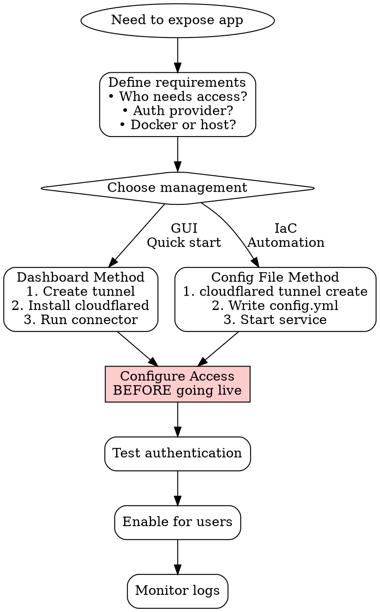
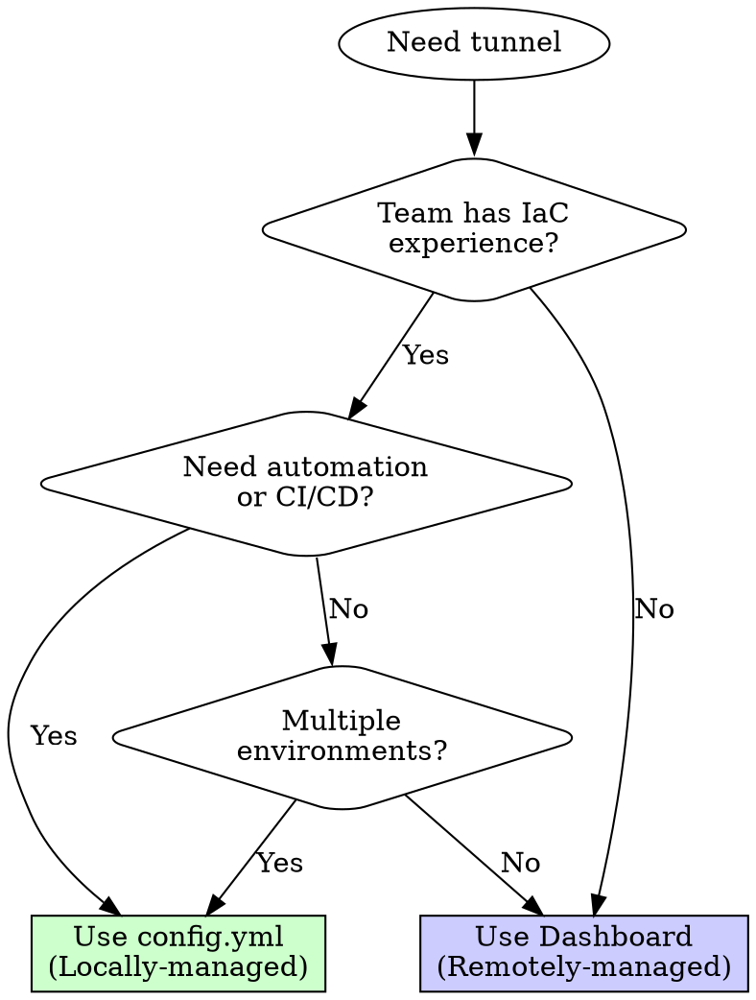

# Cloudflare Zero Trust

## Overview

Cloudflare Zero Trust provides secure remote access to applications without VPN, using Cloudflare Tunnel (secure connectivity) and Cloudflare Access (authentication/authorization).

**Core principle:** Authentication is not optional. Every tunnel must have access controls from day one.

## When to Use

Use this skill when:
- Setting up Cloudflare Tunnel for any application
- Configuring Cloudflare Access authentication
- Exposing internal applications securely
- Replacing VPN access with zero-trust model
- Integrating OIDC/SSO providers (Azure AD, Okta, Google)
- Running cloudflared in Docker containers
- Troubleshooting 502 Bad Gateway errors
- Managing tunnels via dashboard or CLI

**Symptoms that trigger this skill:**
- "Need to expose local app to internet"
- "Setting up Cloudflare Tunnel"
- "Add authentication to tunnel"
- "Configure Azure AD / Okta / OIDC"
- "502 Bad Gateway on Cloudflare Tunnel"
- "Run cloudflared in Docker"

## Security-First Principle

```
UNAUTHENTICATED TUNNEL = PUBLICLY EXPOSED SERVICE = SECURITY INCIDENT
```

**Authentication is mandatory, not optional.**

If you find yourself thinking:
- "We'll add authentication later"
- "It's been working fine without auth"
- "Don't want to disrupt users with login"
- "Can we skip auth for internal apps?"
- "Demo first, secure later"

**STOP. These are security violations.**

Correct mindset:
- Tunnel without auth = exposed service = critical vulnerability
- User convenience < security requirement
- "Internal only" is not a security control
- Demos should be secure by default

## Quick Reference

| Task | Remotely-Managed (Dashboard) | Locally-Managed (config.yml) |
|------|------------------------------|------------------------------|
| **Best for** | GUI users, quick setup, team collaboration | IaC, automation, version control, CI/CD |
| **Setup** | Dashboard → Create Tunnel → Configure routes | `cloudflared tunnel create` + config.yml |
| **Changes** | Click to update | Edit config, restart service |
| **Access Control** | Always via dashboard (Zero Trust → Access) | Tunnel via config, Access via dashboard |
| **Docker** | Env vars for credentials | Mount config.yml + credentials JSON |

## Tunnel Setup Workflow

**BEFORE creating tunnel, choose management approach** using the decision tree in "Dashboard vs CLI Decision Tree" section below.



**Critical:** Configure Access authentication BEFORE exposing the tunnel. Never deploy unauthenticated tunnels, even "temporarily."

## Remotely-Managed Tunnels (Dashboard)

**When to use:**
- Team prefers GUI
- Quick proof-of-concept (that still needs auth!)
- Visual route management
- Less technical team members

**Setup:**
1. **Zero Trust → Networks → Tunnels → Create**
2. **Choose connector type:** Cloudflared
3. **Name tunnel:** e.g., `prod-api-tunnel`
4. **Install cloudflared** on origin server
5. **Run connector:** Copy token from dashboard
   ```bash
   cloudflared service install <TOKEN>
   ```
6. **Configure routes:** Dashboard → Public Hostname
   - Hostname: `api.example.com`
   - Service: `http://localhost:8080`
7. **Configure Access** (see Access Configuration section)

**Advantages:**
- Visual configuration
- Easy for team members
- Built-in health monitoring

**Disadvantages:**
- Not in version control
- Harder to automate
- Must use dashboard for changes

## Locally-Managed Tunnels (config.yml)

**When to use:**
- Infrastructure as code
- CI/CD automation
- Version control for config
- Multiple environments (dev/staging/prod)
- Docker containers

**Setup:**

1. **Create tunnel:**
   ```bash
   cloudflared tunnel create myapp-tunnel
   ```
   Outputs: `~/.cloudflared/<TUNNEL_ID>.json` (credentials)

2. **Create config file** (`~/.cloudflared/config.yml`):
   ```yaml
   tunnel: <TUNNEL_ID>
   credentials-file: /etc/cloudflared/<TUNNEL_ID>.json

   ingress:
     # Route myapp.example.com to local service
     - hostname: myapp.example.com
       service: http://localhost:8080
       originRequest:
         noTLSVerify: false  # Verify origin certs
         connectTimeout: 30s
         httpHostHeader: myapp.example.com

     # Multiple services example
     - hostname: api.example.com
       service: http://localhost:8080
     - hostname: admin.example.com
       service: http://localhost:3000

     # Catch-all (required, must be last)
     - service: http_status:404

   # Logging
   loglevel: info
   ```

3. **Route DNS:**
   ```bash
   cloudflared tunnel route dns myapp-tunnel myapp.example.com
   ```

4. **Run tunnel:**
   ```bash
   # Foreground (testing)
   cloudflared tunnel run myapp-tunnel

   # As service (production)
   sudo cloudflared service install
   sudo systemctl start cloudflared
   sudo systemctl enable cloudflared
   ```

5. **Configure Access** (see next section)

**Advantages:**
- Version controlled
- Easy automation
- Consistent across environments
- Docker-friendly

**Disadvantages:**
- Requires editing config files
- Restart needed for changes
- More initial setup

## Docker Container Setup

**When to use:**
- Containerized infrastructure
- Docker Compose environments
- Kubernetes/orchestration
- Portable deployments

### Docker Compose Example

**Directory structure:**
```
project/
├── docker-compose.yml
├── cloudflared/
│   ├── config.yml
│   └── credentials.json  # From cloudflared tunnel create
```

**docker-compose.yml:**
```yaml
version: '3.8'

services:
  # Your application
  myapp:
    image: myapp:latest
    ports:
      - "8080:8080"
    networks:
      - app-network

  # Cloudflare Tunnel
  cloudflared:
    image: cloudflare/cloudflared:latest
    command: tunnel --config /etc/cloudflared/config.yml run
    volumes:
      - ./cloudflared/config.yml:/etc/cloudflared/config.yml:ro
      - ./cloudflared/credentials.json:/etc/cloudflared/credentials.json:ro
    networks:
      - app-network
    restart: unless-stopped
    depends_on:
      - myapp
    healthcheck:
      test: ["CMD", "cloudflared", "tunnel", "info"]
      interval: 30s
      timeout: 10s
      retries: 3

networks:
  app-network:
    driver: bridge
```

**cloudflared/config.yml:**
```yaml
tunnel: <TUNNEL_ID>
credentials-file: /etc/cloudflared/credentials.json

ingress:
  - hostname: myapp.example.com
    service: http://myapp:8080  # Use container name
    originRequest:
      noTLSVerify: false
  - service: http_status:404

loglevel: info
```

**Setup steps:**
1. Create tunnel: `cloudflared tunnel create myapp-tunnel`
2. Copy `~/.cloudflared/<TUNNEL_ID>.json` to `cloudflared/credentials.json`
3. Update `config.yml` with `<TUNNEL_ID>`
4. Route DNS: `cloudflared tunnel route dns myapp-tunnel myapp.example.com`
5. Start: `docker-compose up -d`
6. Configure Access (dashboard)

**Health checks:**
```bash
# Check tunnel status
docker-compose logs cloudflared

# Verify connections
docker-compose exec cloudflared cloudflared tunnel info
```

### Kubernetes Example

**cloudflared-deployment.yaml:**
```yaml
apiVersion: v1
kind: Secret
metadata:
  name: cloudflared-credentials
type: Opaque
stringData:
  credentials.json: |
    <contents of tunnel credentials>
---
apiVersion: v1
kind: ConfigMap
metadata:
  name: cloudflared-config
data:
  config.yml: |
    tunnel: <TUNNEL_ID>
    credentials-file: /etc/cloudflared/credentials.json
    ingress:
      - hostname: myapp.example.com
        service: http://myapp-service:8080
      - service: http_status:404
---
apiVersion: apps/v1
kind: Deployment
metadata:
  name: cloudflared
spec:
  replicas: 2  # Redundancy
  selector:
    matchLabels:
      app: cloudflared
  template:
    metadata:
      labels:
        app: cloudflared
    spec:
      containers:
      - name: cloudflared
        image: cloudflare/cloudflared:latest
        args:
          - tunnel
          - --config
          - /etc/cloudflared/config.yml
          - run
        volumeMounts:
          - name: config
            mountPath: /etc/cloudflared/config.yml
            subPath: config.yml
          - name: credentials
            mountPath: /etc/cloudflared/credentials.json
            subPath: credentials.json
        livenessProbe:
          exec:
            command:
              - cloudflared
              - tunnel
              - info
          initialDelaySeconds: 30
          periodSeconds: 30
      volumes:
        - name: config
          configMap:
            name: cloudflared-config
        - name: credentials
          secret:
            secretName: cloudflared-credentials
```

## Access Configuration

**Configure Access BEFORE exposing tunnel to users.**

### Self-Hosted Applications

1. **Zero Trust → Access → Applications → Add an application**

2. **Choose "Self-hosted"**

3. **Application Configuration:**
   - **Name:** `My Application`
   - **Session Duration:** `24 hours` (default)
   - **Application domain:** `myapp.example.com`
   - **Accept all available identity providers:** Checked (or select specific)

4. **Add policies** (at least one Allow policy required):

**Example policies:**

**Email-based:**
```
Name: Allow specific users
Action: Allow
Include: Emails → user1@example.com, user2@example.com
```

**Domain-based:**
```
Name: Allow company domain
Action: Allow
Include: Email domains → @company.com
```

**Group-based (requires IdP groups):**
```
Name: Allow admins group
Action: Allow
Include: Azure AD Groups → Admins
```

**Multi-factor authentication:**
```
Name: Require MFA for admins
Action: Allow
Include: Email domains → @company.com
Require: Authentication Method → mTLS, WARP, Service Token (select MFA method)
```

5. **Optional settings:**
   - **Purpose justification:** Require users to state reason for access
   - **Temporary authentication:** Approve access requests manually
   - **IdP groups:** Use groups from Azure AD, Okta, etc.

### SaaS Applications

For integrated SaaS apps (Salesforce, Workday, etc.):

1. **Zero Trust → Access → Applications → Add an application**
2. **Choose "SaaS"**
3. **Select application** from catalog
4. **Follow integration wizard** (varies by app)
5. **Configure policies** (same as self-hosted)

### OIDC / SSO Integration

#### Azure AD (Entra ID)

**Azure AD setup:**
1. **Azure Portal → Azure Active Directory → App registrations → New registration**
2. **Name:** `Cloudflare Access`
3. **Redirect URI:** `https://<your-team-name>.cloudflareaccess.com/cdn-cgi/access/callback`
4. **Register**, copy **Application (client) ID**
5. **Certificates & secrets → New client secret**, copy value
6. **API permissions → Add permission → Microsoft Graph → Group.Read.All** (for group-based policies)
7. **Token configuration → Add groups claim → Security groups**

**Cloudflare configuration:**
1. **Zero Trust → Settings → Authentication → Add new → Azure AD**
2. **Name:** `Azure AD`
3. **App ID:** `<Application (client) ID>`
4. **Client secret:** `<Secret value>`
5. **Directory (tenant) ID:** From Azure AD overview
6. **Support groups:** Checked (if using group-based policies)
7. **Test** and **Save**

**Use in policies:**
```
Name: Allow Admins group
Action: Allow
Include: Azure AD Groups → select "Admins" group
```

#### Okta

1. **Okta Admin → Applications → Create App Integration → OIDC - Web Application**
2. **Name:** `Cloudflare Access`
3. **Grant type:** Authorization Code
4. **Sign-in redirect URI:** `https://<team-name>.cloudflareaccess.com/cdn-cgi/access/callback`
5. **Assignments:** Select groups
6. Copy **Client ID** and **Client secret**

**Cloudflare:**
1. **Zero Trust → Settings → Authentication → Add new → Okta**
2. **Okta account URL:** `https://your-domain.okta.com`
3. **App ID** and **Client secret**
4. **Support groups:** Checked
5. **Test** and **Save**

#### Generic OIDC Provider

For providers not in catalog:

1. **Zero Trust → Settings → Authentication → Add new → OpenID Connect**
2. **Name:** Provider name
3. **App ID (Client ID)**
4. **Client Secret**
5. **Auth URL:** `https://provider.com/oauth2/authorize`
6. **Token URL:** `https://provider.com/oauth2/token`
7. **Certificate URL (JWKS):** `https://provider.com/.well-known/jwks.json`
8. **Proof Key for Code Exchange (PKCE):** Checked if supported
9. **Support groups:** If provider supports groups claim
10. **Test** and **Save**

### Access Policy Design

**Principle: Least privilege by default.**

**Policy evaluation order:**
1. Bypass policies (skip authentication)
2. Block policies (explicit deny)
3. Allow policies (grant access)
4. Service Auth (API tokens, service-to-service)

**Good policy patterns:**

**Production application with role-based access:**
```
Policy 1: Block non-employees
  Action: Block
  Include: Everyone
  Exclude: Email domains → @company.com

Policy 2: Allow developers
  Action: Allow
  Include: Azure AD Groups → Developers

Policy 3: Allow admins
  Action: Allow
  Include: Azure AD Groups → Admins
  Require: MFA
```

**Staging environment:**
```
Policy 1: Allow dev team
  Action: Allow
  Include: Email domains → @company.com
  Require: Azure AD Groups → Developers OR Admins
```

**API with service authentication:**
```
Policy 1: Service-to-service
  Action: Service Auth
  Include: Service Token → api-service-token
```

## Troubleshooting

### 502 Bad Gateway

**Error:** `502 Bad Gateway - Unable to reach the origin service`

**Meaning:** Tunnel is connected to Cloudflare, but can't reach your origin.

**Troubleshooting steps:**

1. **Check origin service is running:**
   ```bash
   curl http://localhost:8080
   ```

2. **Check cloudflared logs:**
   ```bash
   sudo journalctl -u cloudflared -n 50 --no-pager  # Systemd
   docker logs cloudflared  # Docker
   ```

3. **Common causes:**

**Wrong port in config:**
```yaml
# Check config.yml
ingress:
  - hostname: app.example.com
    service: http://localhost:8080  # Port correct?
```

**Docker network issue (non-obvious):**
```yaml
# In Docker Compose, use service name not localhost
service: http://myapp:8080  # NOT http://localhost:8080
```

**TLS verification failure:**
```yaml
originRequest:
  noTLSVerify: true  # Only if origin uses self-signed cert
```

4. **Test tunnel independently:**
   ```bash
   sudo systemctl stop cloudflared
   cloudflared tunnel run myapp-tunnel  # See real-time logs
   ```

### Authentication Loop (Redirect Loop)

**Symptom:** Browser keeps redirecting to login, never reaches app

**Causes:**

1. **Access policy too restrictive:**
   - Check Zero Trust → Access → Applications → Your App → Policies
   - Ensure at least one Allow policy matches your user

2. **IdP misconfiguration:**
   - Verify redirect URI in IdP matches Cloudflare
   - Check group claims are being sent

3. **Cookie issues:**
   - Clear cookies for `*.cloudflareaccess.com` and your domain
   - Check browser isn't blocking third-party cookies

4. **Session expired:**
   - Session duration set too short
   - Increase in Access → Applications → Your App → Session Duration

### Tunnel Not Connecting

**Symptom:** Tunnel shows "Inactive" or "Down" in dashboard

**Troubleshooting:**

1. **Check cloudflared is running:**
   ```bash
   sudo systemctl status cloudflared  # or: docker ps | grep cloudflared
   ```

2. **Verify credentials file exists:**
   ```bash
   ls -la ~/.cloudflared/<TUNNEL_ID>.json
   ```

3. **Firewall requirement:** Cloudflared needs outbound HTTPS (443) to `*.argotunnel.com`

4. **Restart tunnel:**
   ```bash
   sudo systemctl restart cloudflared
   ```

### DNS Not Resolving

**Symptom:** `nslookup myapp.example.com` returns no records

**Fix:**

1. **Check DNS record exists:**
   - Cloudflare dashboard → DNS → Records
   - Look for CNAME: `myapp.example.com` → `<TUNNEL_ID>.cfargotunnel.com`

2. **Create if missing:**
   ```bash
   cloudflared tunnel route dns myapp-tunnel myapp.example.com
   ```

3. **Verify:** DNS record should be "Proxied" (orange cloud) in Cloudflare dashboard

## Common Mistakes

### 1. Deploying Without Authentication

**❌ Wrong:**
```bash
# Create tunnel
cloudflared tunnel create myapp
# Route DNS
cloudflared tunnel route dns myapp myapp.example.com
# Run tunnel
cloudflared tunnel run myapp
# ⚠️ APP IS NOW PUBLICLY ACCESSIBLE
```

**✅ Right:**
```bash
# Create tunnel
cloudflared tunnel create myapp
# Route DNS
cloudflared tunnel route dns myapp myapp.example.com
# Configure Access FIRST (dashboard)
# THEN run tunnel
cloudflared tunnel run myapp
```

### 2. Using `noTLSVerify: true` Without Reason

**❌ Wrong:**
```yaml
originRequest:
  noTLSVerify: true  # "Just in case"
```

**✅ Right:**
```yaml
# Only if origin uses self-signed cert
originRequest:
  noTLSVerify: false  # Verify by default
  # OR if self-signed:
  # noTLSVerify: true
  # caPool: /path/to/custom-ca.pem
```

### 3. Wrong Service URL in Docker

**❌ Wrong:**
```yaml
# config.yml
ingress:
  - hostname: app.example.com
    service: http://localhost:8080  # Won't work in Docker!
```

**✅ Right:**
```yaml
# config.yml
ingress:
  - hostname: app.example.com
    service: http://myapp:8080  # Use container name
```

### 4. Bypass Policy for "Internal" Apps

**❌ Wrong:**
```
Policy: Skip auth for internal
Action: Bypass
Include: Everyone
# ⚠️ Anyone with URL can access!
```

**✅ Right:**
```
Policy: Allow employees
Action: Allow
Include: Email domains → @company.com
```

### 5. Hardcoding Credentials in Config

**❌ Wrong:**
```yaml
# config.yml checked into git
tunnel: abc123-def456-...
credentials-file: /etc/cloudflared/credentials.json
# ⚠️ credentials.json also in git!
```

**✅ Right:**
```bash
# .gitignore
*.json
credentials.json
```

Use environment-specific credentials, never commit.

## Dashboard vs CLI Decision Tree



## Browser Automation (Dashboard Management)

**Note:** Browser automation for dashboard management requires MCP claude-in-chrome tools.

**Use cases:**
- Automated tunnel creation via dashboard
- Bulk configuration changes
- Scheduled tunnel audits
- Programmatic route updates

**Pattern:**
```typescript
// Pseudocode - requires claude-in-chrome MCP
const { navigate, click, fill } = mcp_claude_in_chrome;

// Navigate to Zero Trust dashboard
await navigate('https://one.dash.cloudflare.com/');

// Login flow (use saved session or credentials)
// ...

// Create tunnel
await navigate('Networks/Tunnels');
await click('Create a tunnel');
await fill('Tunnel name', 'new-tunnel');
await click('Save tunnel');

// Configure route
await click('Public Hostname');
await fill('Subdomain', 'myapp');
await fill('Domain', 'example.com');
await fill('Service', 'http://localhost:8080');
await click('Save');
```

**Better alternative: Use Cloudflare API**

```bash
# Get tunnels
curl -X GET "https://api.cloudflare.com/client/v4/accounts/${ACCOUNT_ID}/cfd_tunnel" \
  -H "Authorization: Bearer ${API_TOKEN}"

# Create tunnel
curl -X POST "https://api.cloudflare.com/client/v4/accounts/${ACCOUNT_ID}/cfd_tunnel" \
  -H "Authorization: Bearer ${API_TOKEN}" \
  -H "Content-Type: application/json" \
  --data '{
    "name": "new-tunnel",
    "tunnel_secret": "<base64-secret>"
  }'

# Update config
curl -X PUT \
  "https://api.cloudflare.com/client/v4/accounts/${ACCOUNT_ID}/cfd_tunnel/${TUNNEL_ID}/configurations" \
  -H "Authorization: Bearer ${API_TOKEN}" \
  -H "Content-Type: application/json" \
  --data '{
    "config": {
      "ingress": [
        {
          "hostname": "myapp.example.com",
          "service": "http://localhost:8080"
        },
        {
          "service": "http_status:404"
        }
      ]
    }
  }'
```

**When to use browser automation vs API:**
- **API:** Preferred for automation, CI/CD, scripts
- **Browser:** When API doesn't support feature, visual verification needed

## Red Flags - Security Violations

Stop and reconsider if you find yourself:

- ✋ Creating tunnel without Access configuration
- ✋ Using Bypass policy for "internal" applications
- ✋ Accepting "we'll add auth later" as valid approach
- ✋ Prioritizing demo speed over security
- ✋ Setting `noTLSVerify: true` without specific reason
- ✋ Storing credentials in version control
- ✋ Exposing admin interfaces without MFA requirement
- ✋ Using "it's been working without auth" as argument

**All of these are security incidents, not acceptable tradeoffs.**

## Command Quick Reference

```bash
# Create tunnel
cloudflared tunnel create <NAME>

# List tunnels
cloudflared tunnel list

# Run tunnel (foreground)
cloudflared tunnel run <NAME>

# Route DNS
cloudflared tunnel route dns <NAME> <HOSTNAME>

# Install as service
sudo cloudflared service install

# Service management
sudo systemctl start cloudflared
sudo systemctl stop cloudflared
sudo systemctl restart cloudflared
sudo systemctl status cloudflared

# Check logs
sudo journalctl -u cloudflared -f

# Tunnel info
cloudflared tunnel info <NAME>

# Delete tunnel
cloudflared tunnel delete <NAME>

# Update cloudflared
# macOS
brew upgrade cloudflare/cloudflare/cloudflared
# Linux
wget -q https://github.com/cloudflare/cloudflared/releases/latest/download/cloudflared-linux-amd64.deb
sudo dpkg -i cloudflared-linux-amd64.deb
```

## Sources

This skill is based on:
- [Cloudflare Tunnel Documentation](https://developers.cloudflare.com/cloudflare-one/networks/connectors/cloudflare-tunnel/)
- [Cloudflare Access Documentation](https://developers.cloudflare.com/cloudflare-one/policies/access/)
- [Designing ZTNA Access Policies](https://developers.cloudflare.com/reference-architecture/design-guides/designing-ztna-access-policies/)
- Community troubleshooting patterns from January 2026
