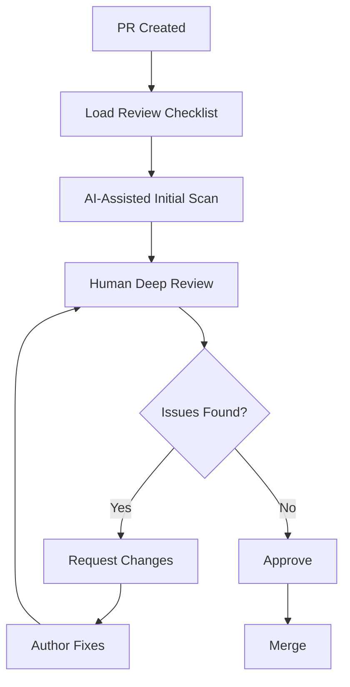

# Code Review Tooling

**Agent-Agnostic** code review guidelines, checklists, and best practices for AI-assisted development.

---

## 📦 What's Included

### 📋 Checklists
- **[code-review-checklist.md](code-review-checklist.md)** - Comprehensive review checklist covering:
  - Code quality and functionality
  - Security considerations
  - Testing coverage
  - Documentation requirements
  - Architecture and design
  - Performance implications

### 📖 Guidelines
- **[pr-review-guidelines.md](pr-review-guidelines.md)** - Complete PR review process including:
  - Step-by-step review workflow
  - Agent-specific workflows (Copilot, Claude, Cursor, Windsurf)
  - Effective comment writing
  - Review scope guidelines
  - Approval criteria

---

## 🤖 Multi-Agent Support

These tools are designed to work with **any** AI coding assistant:

| Agent | Status | Notes |
|-------|--------|-------|
| **GitHub Copilot** | ✅ Supported | Use with Copilot Chat in VS Code |
| **Claude Code** | ✅ Supported | Use with Claude Code CLI or hooks |
| **Cursor** | ✅ Supported | Use with Cursor AI chat |
| **Windsurf** | ✅ Supported | Use with Windsurf assistant |
| **Codeium** | ✅ Supported | Use with Codeium chat |
| **Tabnine** | ✅ Supported | Use as reference |
| **Amazon CodeWhisperer** | ✅ Supported | Use as reference |

---

## 🚀 Quick Start

### For Reviewers

1. **Open the PR** in your preferred tool (GitHub, GitLab, etc.)
2. **Load the checklist**: [code-review-checklist.md](code-review-checklist.md)
3. **Follow the guidelines**: [pr-review-guidelines.md](pr-review-guidelines.md)
4. **Use your AI assistant** to help with the review

**Example prompts for any AI agent:**
```
"Review this PR using the checklist from review-tooling/code-review-checklist.md"
"Check this code for security issues per the review guidelines"
"Suggest improvements based on the code quality section of the checklist"
```

### For Code Authors

Before requesting review:

1. **Self-review** using the checklist
2. **Run automated checks** (linting, tests, security scans)
3. **Write clear PR description** using templates from `../git-workflow/pr-templates/`
4. **Ask your AI assistant** to review your own code first

---

## 💡 Usage Examples

### GitHub Copilot (VS Code)

```typescript
// In Copilot Chat
@workspace Review this file against the code review checklist

// For specific concerns
@workspace Check this PR for security vulnerabilities using our review guidelines

// For the whole PR
@workspace Review all changes in this PR for code quality and best practices
```

### Claude Code

```bash
# Ask Claude to review using the checklist
"Review this file using the guidelines in review-tooling/code-review-checklist.md"

# Security-focused review
"Perform a security review of these changes using the security section of our review checklist"

# Create a review hook (see agents/claude/hooks/)
```

### Cursor

```typescript
// In Cursor AI chat
Review this code using review-tooling/pr-review-guidelines.md

// Specific section
Check for security issues using the security section of code-review-checklist.md

// Apply suggestions
Apply the suggested improvements from the code quality review
```

### Windsurf

```javascript
// In Windsurf assistant
Use review-tooling/code-review-checklist.md to review this PR

// Focus on specific areas
Review testing coverage using our checklist

// Generate review comments
Create review comments for this PR based on our guidelines
```

---

## 📚 Integration Guides

### Integrate with GitHub Actions

Create `.github/workflows/ai-review.yml`:

```yaml
name: AI-Assisted Review Checklist

on:
  pull_request:
    types: [opened, synchronize]

jobs:
  checklist:
    runs-on: ubuntu-latest
    steps:
      - uses: actions/checkout@v3
      - name: Add Review Checklist
        uses: actions/github-script@v6
        with:
          script: |
            const fs = require('fs');
            const checklist = fs.readFileSync('review-tooling/code-review-checklist.md', 'utf8');
            github.rest.issues.createComment({
              owner: context.repo.owner,
              repo: context.repo.repo,
              issue_number: context.issue.number,
              body: '## Review Checklist\n\n' + checklist
            });
```

### Integrate with GitLab CI

Create `.gitlab-ci.yml` addition:

```yaml
review-checklist:
  stage: review
  script:
    - cat review-tooling/code-review-checklist.md
  only:
    - merge_requests
```

### Integrate with Pre-commit Hook

Create `.git/hooks/pre-commit`:

```bash
#!/bin/bash
echo "📋 Review Checklist: review-tooling/code-review-checklist.md"
echo "📖 Review Guidelines: review-tooling/pr-review-guidelines.md"
```

---

## 🎯 Review Workflow



---

## 🔧 Customization

### Adapt the Checklist

Edit `code-review-checklist.md` to add your team's specific requirements:

```markdown
## 🏢 Company-Specific Checks

- [ ] Follows internal API guidelines
- [ ] Uses approved libraries only
- [ ] Meets compliance requirements
- [ ] Includes telemetry for new features
```

### Create Team-Specific Guidelines

Copy and modify `pr-review-guidelines.md`:

```bash
cp review-tooling/pr-review-guidelines.md review-tooling/team-review-guidelines.md
# Edit to add team-specific practices
```

---

## 📊 Metrics

Track review quality:

- **Review Coverage**: % of checklist items verified
- **Time to Review**: Track review turnaround time
- **Defects Found**: Issues caught in review vs. production
- **AI Assistance Usage**: Which prompts are most effective

---

## 🎓 Best Practices

### For Reviewers

1. ✅ **Use the checklist systematically** - Don't skip sections
2. ✅ **Let AI do initial scan** - Save time on obvious issues
3. ✅ **Focus on high-value items** - Architecture, security, maintainability
4. ✅ **Provide context** - Explain "why" not just "what"
5. ✅ **Be consistent** - Apply same standards to all PRs

### For Authors

1. ✅ **Self-review first** - Catch obvious issues before submitting
2. ✅ **Use PR templates** - See `../git-workflow/pr-templates/`
3. ✅ **Keep PRs small** - Aim for < 400 lines
4. ✅ **Respond to all comments** - Even if you disagree, discuss
5. ✅ **Update based on feedback** - Learn from reviews

---

## 🔗 Related Resources

### In This Repository
- [Git Workflows](../git-workflow/) - Branching strategies and commit templates
- [PR Templates](../git-workflow/pr-templates/) - Structured PR descriptions
- [Agent Configurations](../agents/) - Agent-specific setups

### External Resources
- [Google's Code Review Guidelines](https://google.github.io/eng-practices/review/)
- [Thoughtbot Code Review Guide](https://github.com/thoughtbot/guides/tree/main/code-review)
- [Conventional Comments](https://conventionalcomments.org/)

---

## 🤝 Contributing

Improve these review tools:

1. **Add AI prompts** that work well with specific agents
2. **Share team practices** that improve review quality
3. **Create agent-specific integrations** for new AI tools
4. **Update checklists** with new best practices

Submit PRs with improvements!

---

## 📜 License

GNU Affero General Public License v3.0 (AGPL-3.0)

Same license as the main repository. See [LICENSE](../LICENSE).

---

**Last Updated**: January 2026
**Compatibility**: All major AI coding assistants
